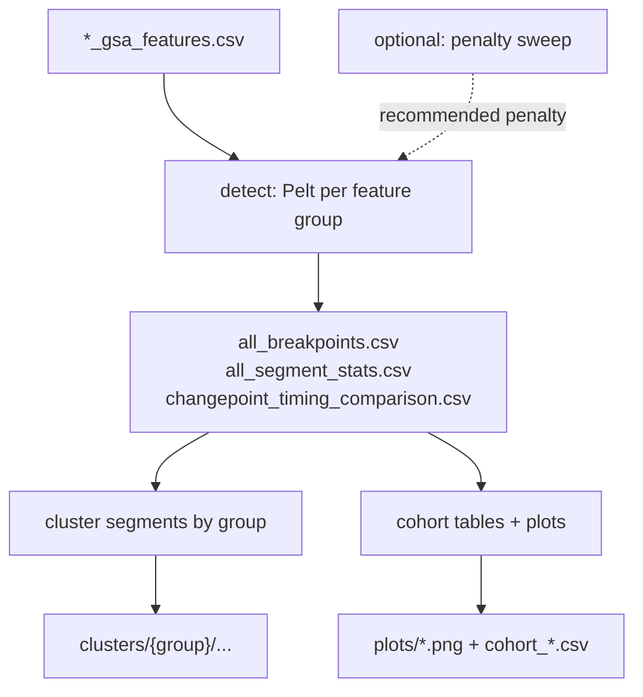

# Changepoint Feature-Group Pipeline

**MD_analysis — developer / user guide**

Detect regime changes in pre-computed GSA feature CSVs, optionally tune the Pelt penalty, cluster the resulting segments, and produce cohort summaries/plots.

Logic lives in `src/ChangepointAnalysis/`. Scripts under `scripts/` are thin argparse wrappers. MDChat exposes the same stages as cohort-level skills (no loaded universe required).

---

## Prerequisites

1. Feature CSVs from `scripts/compute_gsa_features.py` (or equivalent), named `{traj_id}_gsa_features.csv`.
2. Each CSV must include at least `frame` / `time_ps` (optional but recommended) plus the numeric feature columns listed in `src/ChangepointAnalysis/feature_groups.py`.
3. Repo root on `PYTHONPATH` (editable install or run from the repo root as shown below).

```powershell
# From repo root
python scripts/compute_gsa_features.py --help
```

---

## Pipeline overview



| Stage | What it does | Main outputs |
|-------|----------------|--------------|
| **Detect** | Multivariate Pelt (ruptures) on four feature groups | `all_breakpoints.csv`, `all_segment_stats.csv`, timing comparison |
| **Sweep** (optional) | Grid of penalties → elbow recommendation | `penalty_sweep/` summaries + plots |
| **Cluster** | Hierarchical clustering of segment summaries | `clusters/{group}/`, transitions |
| **Summarize** | Cohort Jaccard/regime tables + timeline plots | `cohort_*.csv`, `plots/` |

### Feature groups

| Group | Meaning | Column list |
|-------|---------|-------------|
| `gsa` | Cage / monomer geometry | `GSA_COLS` |
| `iodine` | IOD guest location and contacts | `IODINE_COLS` |
| `na_water` | Cavity water / Na⁺ environment | `NA_WATER_COLS` |
| `combined` | All numeric non-metadata columns | derived from the CSV |

Constants and helpers: `src/ChangepointAnalysis/feature_groups.py`.

---

## Source layout

| Path | Role |
|------|------|
| `src/ChangepointAnalysis/feature_groups.py` | Column lists, colors, group helpers |
| `src/ChangepointAnalysis/detection.py` | `ChangepointConfig`, detection + CSV writers |
| `src/ChangepointAnalysis/penalty_sweep.py` | Elbow / plateau sweep |
| `src/ChangepointAnalysis/segment_clustering.py` | Segment clustering |
| `src/ChangepointAnalysis/reporting.py` | Cohort tables and plots |
| `src/ChangepointAnalysis/pipeline.py` | `ChangepointPipeline` orchestrator |
| `scripts/changepoint_feature_groups.py` | Detect CLI |
| `scripts/sweep_changepoint_penalty.py` | Sweep CLI |
| `scripts/cluster_changepoint_segments.py` | Cluster CLI |
| `scripts/summarize_changepoint_results.py` | Summarize CLI |
| `scripts/run_changepoint_pipeline.py` | End-to-end CLI |
| `src/mdchat/skills/changepoint_pipeline.py` | MDChat skills |
| `tests/test_changepoint_pipeline.py` | Synthetic regression tests |

---

## Quick start (recommended)

One command for detect → cluster → summarize:

```powershell
python scripts/run_changepoint_pipeline.py `
    --features-dir output/gsa_features `
    --output-dir output/changepoints `
    --n-clusters 5
```

With automatic penalty selection (elbow on total breakpoints vs penalty):

```powershell
python scripts/run_changepoint_pipeline.py `
    --features-dir output/gsa_features `
    --output-dir output/changepoints `
    --with-sweep --n-penalties 15 `
    --n-clusters 5
```

Useful flags:

| Flag | Default | Meaning |
|------|---------|---------|
| `--penalty` | auto `log(n)` when normalized | Fixed Pelt penalty |
| `--with-sweep` | off | Sweep first, then detect at elbow |
| `--n-clusters` / `--k` | 5 | Segment clusters per group |
| `--groups` | all four | Subset of `gsa iodine na_water combined` |
| `--skip-clustering` | off | Detect (+ optional summarize) only |
| `--skip-summarize` | off | Skip plots / cohort CSVs |
| `--min-size` | 10 | Minimum segment length (frames) |
| `--jump` | 5 | Ruptures subsample step |
| `--tolerance-frames` | 50 | ± for “shared” breakpoints |

---

## Stage-by-stage CLIs

Use these when you want to re-run one stage without the full pipeline.

### 1. Detect

```powershell
python scripts/changepoint_feature_groups.py `
    --input-dir output/gsa_features `
    --output-dir output/changepoints `
    --method Pelt --cost-model rbf `
    --min-size 10 --jump 5 --tolerance-frames 50
```

Omit `--penalty` to use the BIC-style `log(n)` default after z-score normalization. Pass `--no-normalize` only if you intentionally want raw-scale features (penalty heuristic then falls back to ruptures’ own default).

**Writes (among others):**

- `{traj_id}_breakpoints.csv` / `{traj_id}_segment_stats.csv`
- `all_breakpoints.csv`
- `all_segment_stats.csv`
- `changepoint_timing_comparison.csv`

### 2. Penalty sweep

```powershell
python scripts/sweep_changepoint_penalty.py `
    --input-dir output/gsa_features `
    --output-dir output/changepoints/penalty_sweep `
    --n-penalties 15 `
    --run-final --final-output-dir output/changepoints
```

- Primary recommendation: **elbow** on cohort total breakpoints vs log-penalty.
- Cross-group Jaccard is diagnostic only (each group is segmented independently).
- `--run-final` re-runs detection **in-process** at the recommended penalty (no subprocess).

**Writes:** `penalty_sweep_summary.csv`, `penalty_elbow.csv`, `penalty_recommendation.txt`, optional plots under `penalty_sweep/plots/`.

### 3. Cluster segments

```powershell
python scripts/cluster_changepoint_segments.py `
    --changepoints-dir output/changepoints `
    --output-dir output/changepoints/clusters `
    --n-clusters 5 --linkage ward
```

Requires `all_segment_stats.csv` (or per-trajectory `*_segment_stats.csv`).

**Writes:** `clusters/{group}/segments_clustered.csv`, dendrogram/PCA/inspection artifacts, `all_segments_clustered.csv`, `transitions/{group}/`.

### 4. Summarize / plot

```powershell
python scripts/summarize_changepoint_results.py `
    --changepoints-dir output/changepoints `
    --features-dir output/gsa_features
```

**Writes:** `cohort_timing_summary.csv`, `cohort_segment_regime_summary.csv`, `breakpoints_per_trajectory.csv`, and plots under `plots/` (Jaccard heatmap, breakpoint histogram, cohort overview, optional timelines).

---

## Python API

### End-to-end

```python
from src.ChangepointAnalysis import (
    ChangepointConfig,
    ChangepointPipeline,
    PenaltySweepConfig,
    SegmentClusteringConfig,
)

pipe = ChangepointPipeline(
    "output/gsa_features",
    "output/changepoints",
    detection=ChangepointConfig(penalty=None, min_size=10, jump=5),
    sweep=PenaltySweepConfig(n_penalties=15),  # optional
    clustering=SegmentClusteringConfig(n_clusters=5),
)

artifacts = pipe.run_all(with_sweep=True)
```

Stages can also be called separately; later stages reuse in-memory tables when available, otherwise they read from `output_dir`:

```python
pipe.sweep_penalty()       # sets detection.penalty from elbow
pipe.detect()
pipe.cluster_segments()
pipe.summarize()
```

### Detect only

```python
from pathlib import Path
from src.ChangepointAnalysis import ChangepointConfig, detect_cohort_changepoints
from src.ChangepointAnalysis.detection import discover_feature_csvs

csv_paths = discover_feature_csvs(Path("output/gsa_features"))
tables = detect_cohort_changepoints(
    csv_paths,
    ChangepointConfig(penalty=6.2),
    output_dir=Path("output/changepoints"),
)
print(tables.breakpoints.head())
```

### Key dataclasses

```python
ChangepointConfig          # method, cost_model, penalty, groups, min_size, jump, ...
ChangepointTables          # breakpoints, segment_stats, comparison DataFrames
PenaltySweepConfig         # grid size, thresholds, nested ChangepointConfig
PenaltySweepResult         # summary, elbow, recommended_penalty, ...
SegmentClusteringConfig    # n_clusters, linkage, groups, PCA / all-k options
```

---

## MDChat skills

Register automatically when MDChat loads skills (`/skills` or `/analysis`). Category: `changepoint`. These are **cohort / CSV** skills — they do **not** require a loaded `universe` (unlike the single-array `detect_changepoints` skill).

| Skill | Stage |
|-------|--------|
| `changepoint_feature_groups` | Detect |
| `sweep_changepoint_penalty` | Penalty sweep (+ optional final detect) |
| `cluster_changepoint_segments` | Segment clustering |
| `summarize_changepoint_results` | Cohort tables + plots |
| `run_changepoint_pipeline` | Full chain |

Example asks:

- “Run changepoint detection on `output/gsa_features` into `output/changepoints`.”
- “Sweep the Pelt penalty and re-run detection at the elbow.”
- “Cluster changepoint segments with k=5, then summarize.”

---

## Output schema (compatibility)

Downstream scripts (`compare_state_methods.py`, PT analysis helpers, cluster structure tools, etc.) expect these filenames and columns. Do not rename them casually.

### `all_breakpoints.csv`

`traj_id`, `group`, `breakpoint_idx`, `signal_index`, `frame`, `time_ps`, `n_cols_used`

### `all_segment_stats.csv`

Core: `traj_id`, `group`, `segment_id`, `start_frame`, `end_frame`, `start_ps`, `end_ps`, `n_frames`, `n_cols_used`  
Plus per-group `*_mean` / `*_std` columns from `SUMMARY_COLS`.

### `changepoint_timing_comparison.csv`

`traj_id`, `group_a`, `group_b`, `tolerance_frames`, `n_bkps_a`, `n_bkps_b`, `n_shared`, `jaccard`, `mean_timing_offset_frames`, `mean_timing_offset_ps`

---

## Defaults that matter

| Setting | Typical value | Notes |
|---------|---------------|-------|
| Method / cost | Pelt + `rbf` | Multivariate after z-score |
| Penalty | `log(n)` when normalized | Override with `--penalty` or `--with-sweep` |
| `min_size` | 10 frames | Suppresses very short segments |
| `jump` | 5 | Speed vs resolution trade-off |
| Timing tolerance | 50 frames | Used for Jaccard “shared” matches |
| Clustering | Ward, k=5 | Fixed k by default; `--auto-select-k` available |

---

## Tests

```powershell
python -m pytest tests/test_changepoint_pipeline.py -v
```

Synthetic features with a planted regime shift check output filenames, column sets, and that a breakpoint lands near the planted frame.

---

## Related docs

- Cohort interpretation notes: `output/changepoints/ANALYSIS_SUMMARY.md`
- Presentation-style writeup: `output/changepoints/CHANGPOINT_PIPELINE_PRESENTATION.md`
- Feature extraction entry point: `scripts/compute_gsa_features.py`
- Low-level ruptures wrapper: `src/utils/ruptures_utils.py`
