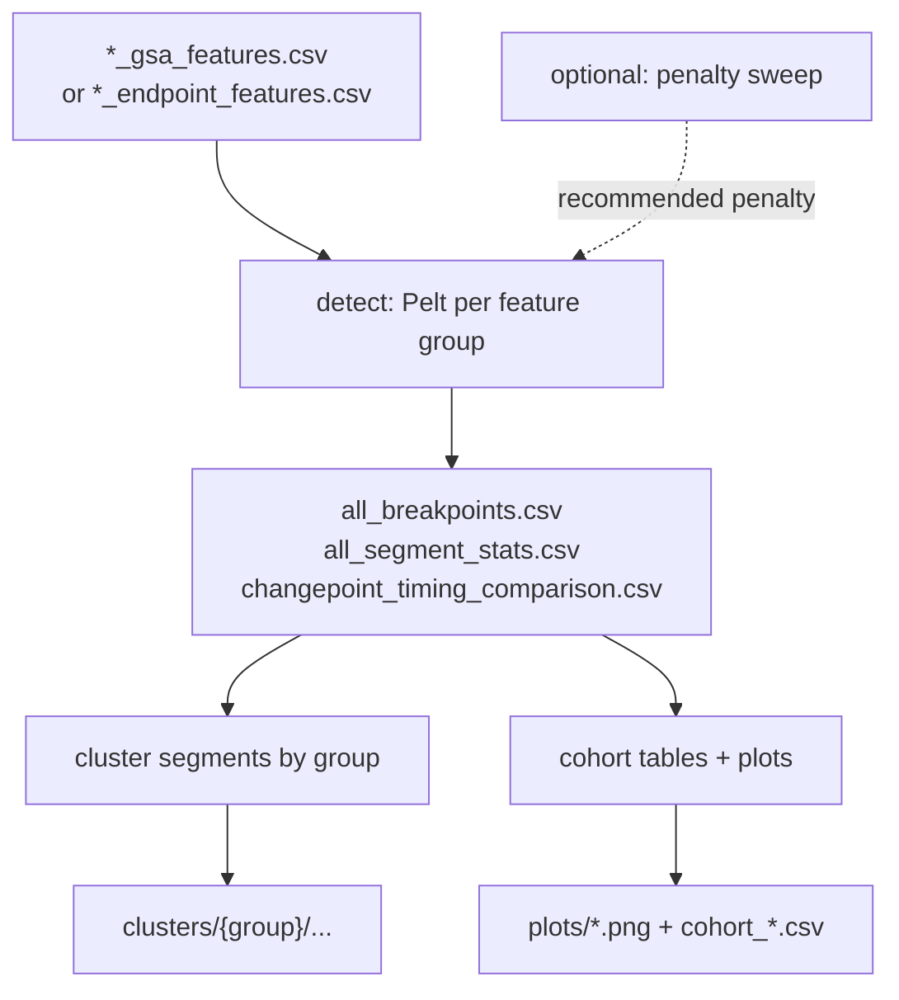
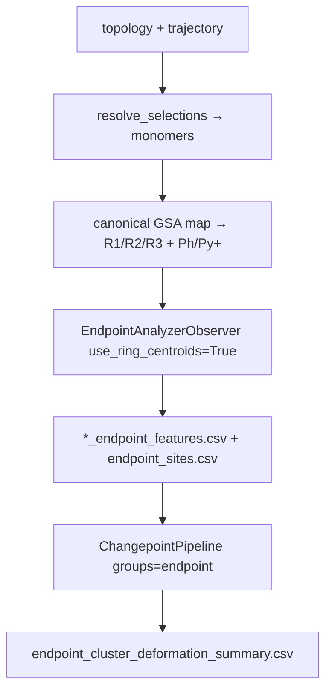

# Changepoint Feature-Group Pipeline

**MD_analysis — developer / user guide**

Detect regime changes in feature time series, optionally tune the Pelt penalty, cluster the resulting segments, and produce cohort summaries/plots.

Two entry paths:

| Path | Input | Feature group(s) | Typical question |
|------|-------|------------------|------------------|
| **GSA features** | Pre-computed `*_gsa_features.csv` | `gsa`, `iodine`, `na_water`, `combined` | Which chemical coordinates change together? |
| **Endpoint sites** | Topology + trajectory → `*_endpoint_features.csv` | `endpoint` | Do ring-centroid / tooth distances recover A→B→C1→C2 deformation motifs? |

Logic lives in `src/ChangepointAnalysis/`. Scripts under `scripts/` are thin argparse wrappers. MDChat exposes the same stages as skills.

---

## Prerequisites

### GSA feature path

1. Feature CSVs from `scripts/compute_gsa_features.py` (or equivalent), named `{traj_id}_gsa_features.csv`.
2. Each CSV must include at least `frame` / `time_ps` (optional but recommended) plus the numeric feature columns listed in `src/ChangepointAnalysis/feature_groups.py`.

### Endpoint-site path

1. Shared topology + one or more trajectories.
2. RDKit available (`pip install -e ".[rdkit]"`) for endpoint / ring detection.
3. Optional: an existing `*_gsa_features.csv` directory if you want an `assembly_rmsd_to_ref` overlay (`--rmsd-from`).

```powershell
# From repo root
python scripts/compute_gsa_features.py --help
python scripts/run_endpoint_changepoint.py --help
```

Repo root must be on `PYTHONPATH` (editable install or run from the repo root).

---

## Pipeline overview



| Stage | What it does | Main outputs |
|-------|----------------|--------------|
| **Detect** | Multivariate Pelt (ruptures) per feature group | `all_breakpoints.csv`, `all_segment_stats.csv`, timing comparison |
| **Sweep** (optional) | Grid of penalties → elbow recommendation | `penalty_sweep/` summaries + plots |
| **Cluster** | Hierarchical clustering of segment summaries | `clusters/{group}/`, transitions |
| **Summarize** | Cohort Jaccard/regime tables + timeline plots | `cohort_*.csv`, `plots/` |

### Feature groups

| Group | Meaning | Column list |
|-------|---------|-------------|
| `gsa` | Cage / monomer geometry | `GSA_COLS` |
| `iodine` | IOD guest location and contacts | `IODINE_COLS` |
| `na_water` | Cavity water / Na⁺ environment | `NA_WATER_COLS` |
| `combined` | All numeric non-metadata columns | derived from the CSV |
| `endpoint` | Site-centroid distances (`endpoint_dist_*`) | **aggregates only by default** (~49 cols); raw site pairs optional |

Constants and helpers: `src/ChangepointAnalysis/feature_groups.py` (`DEFAULT_GROUPS` = the four GSA groups; `ALL_GROUPS` also includes `endpoint`).

**Endpoint detection vs clustering vs attribution (important):**

| Stage | Features used (default) | Why |
|-------|-------------------------|-----|
| **Detect** | Assembly + per-monomer-pair aggregates (~49 cols); excludes raw `endpoint_dist_{i}s{a}_{j}s{b}` | 960 raw site pairs are highly redundant (~26 PCs for 80% variance) and swamp the signal after z-score |
| **Cluster** | Assembly aggregates + every `endpoint_dist_{i}_{j}_mean` mean/std (~39 dims + `log10_n_frames`) | Clusters must encode *which* monomer pair deformed, not only the global mean |
| **Timeline / attribution** | Raw site-pair columns (when present) ranked by **segment-level η²** (or transition standardized Δ) | Frame-level point-biserial against segment labels is attenuated; η² matches the unit clusters were defined on |

Pass `--include-site-pairs-in-detection` to restore the old “all `endpoint_dist_*`” detection matrix. Timeline plots fall back to `endpoint_dist_mean/min/max` when GSA panel columns are absent, or when `--timeline-top-pairs 0`.

---

## Source layout

| Path | Role |
|------|------|
| `src/ChangepointAnalysis/feature_groups.py` | Column lists, colors, group helpers, CSV suffix helpers |
| `src/ChangepointAnalysis/detection.py` | `ChangepointConfig`, detection + CSV writers, `discover_feature_csvs(..., suffix=)` |
| `src/ChangepointAnalysis/penalty_sweep.py` | Elbow / plateau sweep |
| `src/ChangepointAnalysis/segment_clustering.py` | Segment clustering |
| `src/ChangepointAnalysis/cluster_k_diagnostics.py` | Silhouette-vs-k / switching / geometry comparison across B* cohorts (`group=endpoint` or `gsa`) |
| `src/ChangepointAnalysis/gsa_cohort_run.py` | Split mixed `gsa_features_step1` CSVs by cube; run per-cube detect+cluster |
| `src/ChangepointAnalysis/reporting.py` | Cohort tables, plots, `compare_endpoint_clusters_to_deformation`, `summarize_endpoint_cluster_proxies`, `compare_endpoint_clusters_across_cohorts`, segment-η² timeline panels |
| `src/ChangepointAnalysis/murata_d1.py` | Remap stored `endpoint_dist_*` columns onto six equatorial Murata d1 contacts |
| `src/ChangepointAnalysis/transition_attribution.py` | Attribute cluster transitions → ranked site-pair drivers |
| `src/ChangepointAnalysis/pipeline.py` | `ChangepointPipeline`, `run_endpoint_changepoint` |
| `src/EndpointAnalyzer/gsa_site_map.py` | Canonical Murata roles (R1/R2/R3, Ph, Py⁺); same index on every B* cube |
| `src/EndpointAnalyzer/endpoints_finder.py` | Hull fallback `find_endpoint_sites` / ring-system grouping |
| `scripts/changepoint_feature_groups.py` | Detect CLI |
| `scripts/sweep_changepoint_penalty.py` | Sweep CLI |
| `scripts/sweep_gsa_changepoint_penalty.py` | Per-cube GSA sweep launcher (`gsa`/`iodine`, no `--run-final`) |
| `scripts/plot_penalty_sweep_cohorts.py` | Cross-cohort elbow / density / Jaccard figures |
| `scripts/plot_jaccard_metric_comparison.py` | Old vs 1-to-1 Jaccard bars from GSA `all_breakpoints.csv` |
| `scripts/cluster_changepoint_segments.py` | Cluster CLI |
| `scripts/summarize_changepoint_results.py` | Summarize CLI |
| `scripts/compare_changepoint_timing.py` | Post-hoc endpoint vs GSA timing comparison |
| `scripts/compare_endpoint_clusters_across_cohorts.py` | Cross-cohort endpoint cluster vs deformation-proxy tables/plots |
| `scripts/compare_endpoint_cluster_k.py` | Cross-cohort silhouette-vs-k / switching (`--group endpoint` or `gsa`) |
| `scripts/run_gsa_step1_cluster_k.py` | Per-cube GSA changepoint from `gsa_features_step1` + k-diagnostics |
| `scripts/run_changepoint_pipeline.py` | End-to-end CLI (GSA features, one cube per `--features-dir`) |
| `scripts/run_endpoint_changepoint.py` | Trajectory → endpoint features → changepoint |
| `scripts/remap_murata_d1.py` | Map stored site-pair columns onto six equatorial Murata d1 contacts |
| `src/mdchat/skills/changepoint_pipeline.py` | MDChat skills |
| `tests/test_changepoint_pipeline.py` | Synthetic regression tests |

---

## Quick start — GSA features

One command for detect → cluster → summarize:

```powershell
python scripts/run_changepoint_pipeline.py `
    --features-dir output/gsa_features `
    --output-dir output/changepoints `
    --n-clusters 5
```

With automatic penalty selection (elbow on total breakpoints vs penalty):

```powershell
python scripts/run_changepoint_pipeline.py `
    --features-dir output/gsa_features `
    --output-dir output/changepoints `
    --with-sweep --n-penalties 15 `
    --n-clusters 5
```

Useful flags:

| Flag | Default | Meaning |
|------|---------|---------|
| `--penalty` | auto `log(n)` when normalized | Fixed Pelt penalty |
| `--with-sweep` | off | Sweep first, then detect at elbow |
| `--n-clusters` / `--k` | 5 | Segment clusters per group |
| `--groups` | all four | Subset of `gsa iodine na_water combined` |
| `--skip-clustering` | off | Detect (+ optional summarize) only |
| `--skip-summarize` | off | Skip plots / cohort CSVs |
| `--min-size` | 10 | Minimum segment length (frames) |
| `--jump` | 5 | Ruptures subsample step |
| `--tolerance-frames` | 50 | Window for “shared” breakpoints |

**Mixed `gsa_features_step1` folder (all B\* cubes together):** do **not** point `--features-dir` at that folder as a whole — clustering would mix cubes. Stage per cube and run k-diagnostics with:

```powershell
python scripts/run_gsa_step1_cluster_k.py `
    --features-dir output/gsa_features_step1 `
    --output-root output `
    --out-dir output/gsa_cluster_k_diagnostics `
    --workers 6
```

Writes `output/gsa_changepoints_{CUBE}/` (`--groups gsa` only, skip summarize/PCA) plus the same silhouette / switching tables as the endpoint comparison. BMHpM CSVs in a subdirectory are picked up. Re-run diagnostics only with `--skip-detect`. Existing `output/changepoints` is an older BMMpM-only 500-frame run; do not reuse it for step-1.

---

## Quick start — endpoint sites (A / B / C1 / C2)

Use this path when you want to ask whether **endpoint geometry alone** recovers the paper's escalating deformation motifs (perfect cube → one cation–π open → two open with closed d1 → two open with elongated d1).

### Ring centroids, not atom–atom distances

A cation–π contact is measured from the **ring centroid**, not from individual ring atoms. The extractor therefore:

1. Maps each GSA monomer to **canonical Murata roles** (`src/EndpointAnalyzer/gsa_site_map.py`): pole **R1**, equatorial **R2**/**R3**, terminal **Ph**, and the two **Py⁺** rings. Hull-order `s3`/`s7` indices are **not** used for GSA cubes — they shifted when a methyl converted a ring site into an atom site (BMHpM vs BMMpH looked like the same 4+4 map but were chemically different).
2. Computes **site-centroid ↔ site-centroid** distances each frame (`EndpointAnalyzerObserver(use_ring_centroids=True)`).

Fixed site indices on every B\* cube (core pattern `Ph-linker — R1 — Py-linker — R3 — Py-linker — R2`):

| Index | Role | Kind | Plot label | Chemistry |
|------:|------|------|------------|-----------|
| 0 | `ph` | ring | Ph | Terminal phenyl |
| 1 | `ph_para` | atom | Ph-p | Para carbon of Ph |
| 2 | `py_eq` | ring | Py-eq | Equatorial Py⁺ |
| 3 | `r2` | atom | R2 | Equatorial R2 (methyl C if CH3, para C if H) |
| 4 | `r3` | atom | R3 | Equatorial R3 |
| 5 | `py_pole` | ring | Py-pole | Pole-side Py⁺ |
| 6 | `r1` | atom | R1 | Pole R1 (cube vertex) |
| 7 | `r1_ring` | ring | R1-ring | Pole aryl |

Cohort names decode as `B[eq][eq]p[pole]` (H = hydrogen, M = methyl). Methyl occupancy of those roles:

| Cube | Methyl at | Murata |
|------|-----------|--------|
| BHHpH | none | not in Murata |
| BHHpM | R1 | 3₆ |
| BMHpH | R3 | not in Murata |
| BMHpM | R1 + R3 | **2₆** (R2=H, R3=CH3) |
| BMMpH | R2 + R3 | not in Murata |
| BMMpM | R1 + R2 + R3 | 1₆ |

This maps chemically to:

| Paper parameter | Endpoint-site proxy |
|-----------------|---------------------|
| **R1 / R2 / R3** | Canonical atom sites (methyl carbon if CH3, para carbon if H) |
| **Paper d1** (compact **4.5–5.5 Å**, elongated **≥ 7.0 Å**) | Ipso carbons C2–C3 of **R2** and **R3**, columns `paper_d1_m{i}r2_m{j}r3` / `paper_d1_m{i}r3_m{j}r2` |
| **Ph / Py⁺** | Ring-centroid sites for cation–π geometry |
| Other openings / elongation | Additional `endpoint_dist_*` site–site columns |

**Important:** Murata's d1 is the C2–C3 pair across an equatorial edge (R2 of one monomer interlocking with R3 of the neighbor). It is **not** hull indices `s3`/`s7` and not a pole–equator distance. When R=H the ipso carbon *is* the endpoint atom; when R=CH3 d1 steps in from the methyl carbon onto that ipso carbon.

**QC plot (`endpoint_sites.png`).** Blue = ring-system site; orange = atom site. Atom highlights are drawn **on top of** ring highlights, so when R=H the para carbon (orange **R1** / **R2** / **R3** / **Ph-p**) remains visible on its blue ring rather than being covered by **R1-ring** / **Ph**. Labels follow the same order (orange text last). Existing `*_endpoint_features.csv` files are still from the old hull-index run until you re-extract.

We do **not** hard-code A/B/C1/C2 labels. Continuous site distances go into the changepoint pipeline; clusters are then compared against the expected RMSD ordering (~1.0 / 1.5 / 1.6–2.5 / 2.7 Å). For motif reading, flag a corrected d1 contact as **compact** when its distance sits in **4.5–5.5 Å** (`closed` &lt; 4.5, `elongated` &gt; 5.5). Note: the pipeline still names the 4.5–5.5 Å bin `paper_d1_n_open` (inverted vs Murata; see G0).



### CLI

```powershell
python scripts/run_endpoint_changepoint.py `
  --topology traj/BHHpH_ca.prmtop `
  --trajectories "traj/BHHpH_*_mdcrd_v.trj" `
  --gsa-resname MOL `
  --output-dir output/endpoint_changepoints `
  --rmsd-from output/gsa_features `
  --include-site-pairs `
  --with-sweep
```

Nested HPC layout (`$TRAJ_DIR/<run_id>/mdcrd_v`), with trajectory-level parallel by default:

```bash
python scripts/run_endpoint_changepoint.py \
  --topology "$TOPOLOGY" \
  --trajectories "$TRAJ_DIR/*/mdcrd_v" \
  --gsa-resname MOL \
  --output-dir output/endpoint_changepoints \
  --include-site-pairs \
  --traj-jobs -1
```

IDs for bare `mdcrd_v` files become `{parent_folder}_mdcrd_v` (e.g. `109345_mdcrd_v`).

| Flag | Effect |
|------|--------|
| `--no-ring-centroids` | Flat atom endpoints instead of ring-system centroids |
| `--include-site-pairs` | Also emit `endpoint_dist_{i}s{a}_{j}s{b}` (**required** for transition attribution and η² timeline panels) |
| `--include-site-pairs-in-detection` | Feed raw site-pair columns into Pelt (default **off** = aggregates only, ~49 cols) |
| `--no-paper-d1` | Disable corrected paper-d1 features (enabled by default) |
| `--paper-d1-open-lo` / `--paper-d1-open-hi` | Open cation–π window in Å (default 4.5–5.5) |
| `--rmsd-from DIR` | Overlay mean `assembly_rmsd_to_ref` per cluster from `*_gsa_features.csv` |
| `--step N` | Trajectory frame stride |
| `--traj-jobs N` | Parallel workers across trajectories (default `-1` = all CPUs, capped by traj count) |
| `--n-jobs N` | Parallel workers for frames within one trajectory (default: `1` when traj-jobs>1) |
| `--use-dask` | Use Dask Distributed for the endpoint distance pass |
| `--max-workers-for-io N` | Cap I/O-bound workers (iterator default limit is 16) |
| `--features-dir` | Where to write features (default: `<output-dir>/endpoint_features`) |
| `--with-sweep` | Penalty sweep before final detection |
| `--n-clusters` / `--k` | Segment clusters (default 5) |
| `--timeline-top-pairs` | Top-N site-pair (or pair-mean) features for `timeline_cluster_*.png` by segment η² (default 5; `0` = aggregate panels only) |
| `--skip-transition-attribution` | Skip post-clustering site-pair driver attribution |
| `--transition-top-n` | Keep top-N drivers per directed transition (default 10) |
| `--transition-min-abs-corr` | Drop drivers with \|point-biserial r\| below this threshold |

**Outputs under `--output-dir`:**

| Artifact | Role |
|----------|------|
| `endpoint_features/*_endpoint_features.csv` | Per-frame site-distance features (+ `paper_d1_*` when enabled) |
| `endpoint_features/endpoint_sites.csv` | Site map: `monomer`, `site_index`, `role` (`r1`/`r2`/`r3`/`ph`/…), `label`, `kind`, `atom_ids` |
| `endpoint_features/paper_d1_atoms.csv` | R2/R3 ipso carbons (C2–C3); `endpoint_atom_id` vs `d1_ring_atom_id` when R=CH3 |
| `endpoint_features/endpoint_sites.png` | Topology QC: blue=ring, orange=atom **on top** (R=H para carbons stay orange) |
| `all_breakpoints.csv`, `all_segment_stats.csv`, … | Standard changepoint tables (`group=endpoint`; segment stats include per-monomer-pair aggregates) |
| `clusters/` | Segment clusters (chosen-k under `clusters/endpoint/`; `by_k/` is inspection-only) |
| `endpoint_cluster_deformation_summary.csv` | Clusters ordered by mean endpoint distance (+ optional RMSD) |
| `endpoint_pair_cluster_correlation.csv` | Site-pair (or pair-mean) ranking by segment-level η² vs cluster |
| `plots/endpoint_cluster_deformation.png` | Bar/scatter vs deformation proxy |
| `plots/timeline_cluster_{k}_{traj}.png` | Medoid-segment timelines: `endpoint_dist_mean` + top-N pairs labeled `M0S3-M1S6 (Å)  η²=…` |
| `endpoint_transition_events.csv` | Consecutive directed cluster transitions |
| `endpoint_transition_feature_rankings.csv` | All site-pair + paper-d1 features ranked per directed transition |
| `endpoint_transition_top_features.csv` | Top-N drivers with site/atom mapping |
| `paper_d1_transition_top_features.csv` | Top-N corrected d1 drivers only |
| `paper_d1_segment_states.csv` | Per-segment mean d1 + open/closed/elongated pair lists |
| `plots/endpoint_transition_feature_heatmap.png` | Transitions × pairs colored by signed standardized Δ |
| `plots/endpoint_transition_network_attributed.png` | Transition network labeled by top mapped pairs |
| `plots/endpoint_sites_transition_{from}_to_{to}.html` | Interactive 3D NGL view (raw sites + paper-d1 cylinders) |
| `plots/endpoint_sites_transition_{from}_to_{to}_pair_ranks.png` | Ranked-pair bar chart companion |

### Reading results vs A / B / C1 / C2

1. Order clusters by mean endpoint-site distance (the deformation summary CSV already sorts this way).
2. If `--rmsd-from` was set, compare each cluster's mean RMSD to the paper peaks (A≈1.0, B≈1.5, C1≈1.6–2.5, C2≈2.7 Å). When GSA features are unavailable, use the **four deformation proxies** below (endpoint distance, paper d1, site-pair η², Cohen's *d* direction) as RMSD substitutes.
3. With `--include-site-pairs`, inspect which individual site-pair distances jump at breakpoints — a single large jump suggests B; two openings plus an elongated equatorial pair suggest C2.
4. Check `endpoint_pair_cluster_correlation.csv` / `timeline_cluster_*.png` for the site pairs with highest **segment-level η²** (fraction of between-cluster variance). Labels look like `M2S0-M5S0`.
5. Use **transition attribution** (below) to rank which mapped site pairs drive each directed cluster change.

### Cross-cohort cluster proxy comparison (B\* cubes)

After running endpoint changepoint on multiple cube variants (e.g. `output/endpoint_changepoints_BHHpH`, `…_BMMpM`), compare Ward clusters **across cohorts** without re-detecting or re-clustering.

**Why `deformation_rank`?** `cluster_label` integers are arbitrary per cohort (SciPy Ward cut). Cross-cohort alignment uses **`deformation_rank`**: 0 = smallest mean `endpoint_dist_mean` (most closed), increasing to the most open cluster in that cube.

**Four deformation proxies** (used when `assembly_rmsd_to_ref` was not overlaid):

| # | Proxy | Source | Meaning |
|---|-------|--------|---------|
| 1 | Endpoint distance | `endpoint_cluster_deformation_summary.csv` | Assembly-wide cage opening (Å) |
| 2 | Paper d1 | `paper_d1_segment_states.csv` | Cation–π geometry (`paper_d1_min_mean`, `n_open_pairs`, …) |
| 3 | Site-pair η² | Top rows of `endpoint_pair_cluster_correlation.csv` | Which named contacts explain cluster variance |
| 4 | Cohen's *d* direction | `cohens_d_best` on top pairs where `best_cluster` matches | +*d* = more open for that pair; −*d* = more closed vs other clusters |

Clusters with `n_segments < 5` are flagged `low_confidence=True` (e.g. singleton BMHpH clusters) and excluded from rank-averaged cross-cohort tables.

```powershell
python scripts/compare_endpoint_clusters_across_cohorts.py `
  --output-root output `
  --pattern "endpoint_changepoints_B*" `
  --exclude-test `
  --out-dir output/endpoint_cluster_cross_cohort `
  --top-pairs 10
```

Auto-discovers production dirs matching the pattern; skips `*_test` / `*_smoke`. Pass explicit dirs with `--cohort-dirs` to override discovery.

**Writes under `--out-dir`:**

| Artifact | Role |
|----------|------|
| `cluster_proxy_summary.csv` | Long table: `cohort`, `cluster_label`, `deformation_rank`, all four proxies, segment counts |
| `cluster_proxy_by_rank.csv` | Pivoted: rows = `deformation_rank`, columns = cohort × proxy (slide heatmaps) |
| `top_site_pairs_by_cohort.csv` | Top η² pairs per cohort + cross-cohort frequency (`cohort_count`) |
| `pair_best_cluster_matrix.csv` | Which cluster each top pair marks + `deformation_rank_of_best_cluster` |
| `plots/deformation_rank_vs_endpoint_dist.png` | Heatmap: rank × cohort, colored by mean endpoint distance |
| `plots/deformation_rank_vs_paper_d1.png` | Heatmaps for `paper_d1_min_mean` and `n_open_pairs` |
| `plots/top_pairs_eta2_heatmap.png` | Cohort × top-5 pair labels, colored by η² |
| `plots/proxy_consistency_scatter.png` | Per-cohort scatter: endpoint distance vs paper d1 (points labeled by rank) |

**Interpretation workflow (cross-cohort):**

1. For each `deformation_rank`, compare mean endpoint distance across BHH / BMH / BMM and pH / pM variants.
2. Check whether paper d1 shifts consistently with rank (note: many segments are `elongated` in Å; read **relative** rank changes, not absolute 4.5–5.5 Å windows).
3. Inspect `top_site_pairs_by_cohort.csv` for recurring contacts at the same rank (e.g. M2–M3 face pairs).
4. Use `cohens_d_direction` on the cluster's dominant top pair to read open vs closed for that contact.

Python:

```python
from pathlib import Path
from src.ChangepointAnalysis import (
    compare_endpoint_clusters_across_cohorts,
    summarize_endpoint_cluster_proxies,
)

# Single cohort
proxies = summarize_endpoint_cluster_proxies(
    "output/endpoint_changepoints_BMMpM",
    top_pairs=10,
)

# All B* cubes
cohorts = sorted(Path("output").glob("endpoint_changepoints_B*"))
cohorts = [p for p in cohorts if "_test" not in p.name and "_smoke" not in p.name]
written = compare_endpoint_clusters_across_cohorts(
    cohorts,
    "output/endpoint_cluster_cross_cohort",
    top_pairs=10,
)
```

GSA step-1 k-diagnostics (after per-cube `gsa_changepoints_*` dirs exist):

```python
from src.ChangepointAnalysis import (
    compare_cluster_k_diagnostics,
    run_gsa_step1_cohorts,
)

run_gsa_step1_cohorts("output/gsa_features_step1", "output", workers=6)
written = compare_cluster_k_diagnostics(
    list(Path("output").glob("gsa_changepoints_B*")),
    "output/gsa_cluster_k_diagnostics",
    group="gsa",
)
```

Talk-track for cluster definition and η² / Cohen's *d*: [endpoint_cluster_discrimination.md](endpoint_cluster_discrimination.md).

### Why k=5, and why BMMpM’s silhouette rises

All B\* endpoint runs are cut at **fixed k=5** (`--n-clusters`). Silhouette curves under `clusters/endpoint/silhouette_by_k.csv` are inspection-only. BHHpM peaks at k=6; BHHpH / BMHpM have a weak local bump at k=6 after k=2 already wins; BMMpM’s score keeps climbing because paper d1 never enters the 4.5–5.5 Å window and Pelt barely switches.

```powershell
python scripts/compare_endpoint_cluster_k.py `
  --output-root output `
  --pattern "endpoint_changepoints_B*" `
  --exclude-test `
  --out-dir output/endpoint_cluster_k_diagnostics
```

Writes `silhouette_peaks.csv`, `segment_dynamics.csv`, `site_and_d1.csv`, `k_split.csv`, and `plots/silhouette_vs_k.png` (plus switching / d1 / site-kind figures). Full talk-track: [endpoint_cluster_discrimination.md §10](endpoint_cluster_discrimination.md#10-why-every-b-run-has-five-clusters-and-why-bmmpm-differs).

The same tables for **cage-geometry GSA** (no paper-d1) after `run_gsa_step1_cluster_k.py`:

```powershell
python scripts/compare_endpoint_cluster_k.py `
  --group gsa `
  --output-root output `
  --pattern "gsa_changepoints_B*" `
  --out-dir output/gsa_cluster_k_diagnostics
```

```python
from src.ChangepointAnalysis import compare_cluster_k_diagnostics

written = compare_cluster_k_diagnostics(
    list(Path("output").glob("gsa_changepoints_B*")),
    "output/gsa_cluster_k_diagnostics",
    group="gsa",
)
```

See [endpoint_cluster_discrimination.md §11](endpoint_cluster_discrimination.md#11-gsa-cage-geometry-k-diagnostics-gsa_features_step1).

### Feature column schema (`*_endpoint_features.csv`)

| Columns | Meaning |
|---------|---------|
| `traj_id`, `frame`, `time_ps` | Metadata |
| `endpoint_dist_{i}_{j}_{min,mean,max}` | Aggregates over all site-pairs between monomers *i* and *j* |
| `endpoint_dist_{mean,min,max,std}` | Assembly-wide aggregates |
| `endpoint_dist_{i}s{a}_{j}s{b}` | Optional raw site–site distance (`--include-site-pairs`) |
| `paper_d1_m{i}r2_m{j}r3` / `paper_d1_m{i}r3_m{j}r2` | Murata d1: R2/R3 ipso carbons (C2–C3); enabled by default |
| `paper_d1_min`, `paper_d1_n_open`, … | Assembly summaries over all directional d1 contacts |

`endpoint_sites.csv` includes `role` so site index 3 is **R2** and index 6 is **R1** on every B* cohort. Hull fallback (non-GSA monomers) leaves `role` blank and labels sites `s{k}:R` / `s{k}:A`.

### Paper d1 (R2/R3 equatorial ipso carbons)

Murata's **d1** is C2–C3: the ipso carbons bonding to **R2** and **R3**, across an equatorial edge where those groups interlock. The extractor takes those atoms from the canonical GSA map (`endpoint_kind` = `methyl` or `hydrogen` in `paper_d1_atoms.csv`). Hull indices `s3`/`s7` are not used for GSA cubes.

Legacy `paper_d1_m{i}s3_m{j}s7` columns may still appear for non-GSA monomers (hull fallback). Old hull-index feature CSVs under `output/endpoint_changepoints_*/` are **not** these columns until you re-run extraction.

| State | Distance window |
|-------|-----------------|
| `closed` | &lt; 4.5 Å |
| `open` (cation–π) | 4.5–5.5 Å |
| `elongated` | &gt; 5.5 Å |

Outputs: `paper_d1_atoms.csv` (atom map), `paper_d1_*` columns in the features CSV, `paper_d1_segment_states.csv`, and d1 cylinders in the transition NGL HTML (green=open, gray=closed, magenta=elongated).

### Remap stored pairs → Murata equatorial d1

Existing `*_endpoint_features.csv` files still use hull `s3`/`s7` paper-d1 columns (all 30 monomer-pair directions). Do **not** re-read trajectories. `scripts/remap_murata_d1.py` matches hull sites to canonical **R2/R3**, keeps the **six equatorial** interlocking contacts (Hungarian assignment on median R2(i)→R3(j) distance), and classifies with Murata's windows — not the inverted `paper_d1_n_open` bin:

| State | Distance |
|-------|----------|
| compact | 4.5–5.5 Å |
| elongated | ≥ 7.0 Å |
| short / intermediate | &lt; 4.5 Å or 5.5–7.0 Å |

```powershell
python scripts/remap_murata_d1.py `
    --output-root output `
    --out-dir output/murata_d1
```

**Equatorial edges (same 6-cycle on every cube):** 0→4, 1→5, 2→3, 3→1, 4→2, 5→0. Example column: `endpoint_dist_0s2_4s7` on BHHpH is monomer 0 R2 with monomer 4 R3.

**Cohort result** (`output/murata_d1/murata_d1_summary.csv`, ~50 k frames × 6 edges):

| Cube | Median d1 (Å) | Compact 4.5–5.5 | Elongated ≥ 7 | Stored pair |
|------|---------------|-----------------|---------------|-------------|
| BHHpH | 4.97 | 77% | 10% | R2/R3 aryl (H) |
| BHHpM | 4.99 | 75% | 14% | R2/R3 aryl (H) |
| BMHpH | 5.04 | 37% | 8% | R2 aryl – R3 methyl |
| BMHpM | 5.06 | 37% | 8% | R2 aryl – R3 methyl |
| BMMpH | 4.30 | 27% | 0.3% | R2 methyl – R3 methyl |
| BMMpM | 4.33 | 27% | 2% | R2 methyl – R3 methyl |


BHHpH / BHHpM (equator = H) pass Murata's compact window, with a weaker elongated shoulder near 8–9 Å. That is the sanity check the old hull `s3`/`s7` columns failed (~9–17 Å). BMH / BMM sit short because those CSVs store **methyl carbons**, not ipso C2/C3 (~0.7 Å offset). True C2–C3 for methyl cubes still needs an ipso–ipso extract.

**Writes under `--out-dir`:**

| Artifact | Role |
|----------|------|
| `{CUBE}/role_site_map.csv` | Hull `site_index` per canonical role (`r2`/`r3`/…) |
| `{CUBE}/equatorial_edges.csv` | The six R2(i)→R3(j) columns + median Å |
| `{CUBE}/murata_d1_frames.csv` | Per-frame `d1_e{k}_m{i}r2_m{j}r3` + `murata_d1_n_compact` / `_n_elongated` |
| `{CUBE}/murata_d1_summary.csv` | One-row occupancy for that cube |
| `murata_d1_summary.csv` / `equatorial_edges.csv` / `role_site_map.csv` | Stacked across cubes |
| `plots/murata_d1_overview.png` | Histogram + compact/elongated bars |

**Proxy caveat:** stored `endpoint_dist_*` values are site centroids. On BHHpH the hull kept the whole R2/R3 aryl as a ring (centroid ≈ C2–C3). When R=CH3 the site is the methyl carbon. Do not quote BMH/BMM compact fractions as Murata C2–C3 until ipso–ipso is re-extracted.

### Cluster timeline panels (segment-level η²)

After clustering, summarize ranks endpoint features for `plots/timeline_cluster_*.png`:

1. Prefer raw site-pair columns `endpoint_dist_{i}s{a}_{j}s{b}` when present (`--include-site-pairs`); else fall back to `endpoint_dist_{i}_{j}_mean`.
2. For each clustered segment, take the **mean** of each candidate feature over `[start_frame, end_frame]` (raw Å; not per-traj z-scored — absolute levels carry cross-trajectory cluster signal).
3. Score each feature by **η²** (fraction of between-cluster variance), with Kruskal–Wallis ε² as a robustness column.
4. Plot `endpoint_dist_mean` plus the top-N pairs, labeled e.g. `M2S0-M5S0 (Å)  η²=0.81`.

Auditable ranking: `endpoint_pair_cluster_correlation.csv`. Medoid CSVs are taken from `clusters/<group>/cluster_representatives.csv` only (`by_k/` inspection outputs are ignored unless you pass `--cluster-representatives-csv` explicitly).

Talk-track / formulas (cohort-wide cluster definition, η², Cohen’s *d*, why frame-level |r| was attenuated): [endpoint_cluster_discrimination.md](endpoint_cluster_discrimination.md) (§2).

### Transition driver attribution

After endpoint clustering, the pipeline can attribute each **directed** consecutive-segment transition (`from_cluster → to_cluster`) to the raw site-pair columns **and** corrected paper-d1 columns that change most strongly.

**Requires** `--include-site-pairs`. Without those columns, attribution is skipped with a warning.

**Clustering** uses assembly + per-monomer-pair aggregate summaries written into `all_segment_stats.csv` (not the raw site-pair series). Attribution deliberately returns to the per-frame site-pair / paper-d1 series.

**Scoring (per directed transition type):**

For each site-pair feature:

| Statistic | Definition |
|-----------|------------|
| `mean_source` / `mean_dest` | Mean distance (Å) over source / destination segment frames |
| `mean_delta_angstrom` | `mean_dest − mean_source` (signed) |
| `mean_standardized_delta` | Δ divided by the pooled cohort std of that feature |
| `mean_point_biserial_corr` | Point-biserial correlation of the distance with destination-membership |
| `combined_score` | `0.5 × (abs_std_Δ / max_abs_std_Δ) + 0.5 × \|r\|` within the directed transition |
| `rank` | Descending `combined_score` within `from→to` |
| `n_events` / `n_trajectories` | How often this directed transition was observed |
| `is_descriptive` | `True` when `n_events < 2` (no replication; treat as descriptive) |

Frame joins are **stride-safe**: segments select rows by actual `frame` values, not integer indices.

**Interpretation notes**

- Positive Δ / positive r: the site–site distance **opens** on entering the destination cluster.
- Negative Δ / negative r: the pair **closes**.
- When a transition type has only one observed event (common in single-trajectory tests), rankings remain useful for hypothesis generation but are marked `is_descriptive=True` — do not treat correlations as statistically replicated.
- Prefer reading `endpoint_transition_top_features.csv` together with the attributed network PNG: edge width = transition count; edge labels = top mapped pairs with signed Δ.

**CLI / skill controls**

- `--transition-top-n` / `transition_top_n` (default 10)
- `--transition-min-abs-corr` / `transition_min_abs_corr` (default 0)
- `--skip-transition-attribution` / `skip_transition_attribution`

Python API: `ChangepointPipeline.attribute_endpoint_transitions(...)` or `attribute_endpoint_transitions(...)` from `src.ChangepointAnalysis`.

---

## Stage-by-stage CLIs (GSA features)

Use these when you want to re-run one stage without the full pipeline.

### 1. Detect

```powershell
python scripts/changepoint_feature_groups.py `
    --input-dir output/gsa_features `
    --output-dir output/changepoints `
    --method Pelt --cost-model rbf `
    --min-size 10 --jump 5 --tolerance-frames 50
```

Omit `--penalty` to use the BIC-style `log(n)` default after z-score normalization. Pass `--no-normalize` only if you intentionally want raw-scale features (penalty heuristic then falls back to ruptures’ own default).

**Writes (among others):**

- `{traj_id}_breakpoints.csv` / `{traj_id}_segment_stats.csv`
- `all_breakpoints.csv`
- `all_segment_stats.csv`
- `changepoint_timing_comparison.csv`

### 2. Penalty sweep

```powershell
python scripts/sweep_changepoint_penalty.py `
    --input-dir output/gsa_features `
    --output-dir output/changepoints/penalty_sweep `
    --n-penalties 15 `
    --run-final --final-output-dir output/changepoints
```

- Primary recommendation: **elbow** on cohort total breakpoints vs log-penalty.
- Cross-group Jaccard is diagnostic only (each group is segmented independently). `compare_breakpoints` uses 1-to-1 matching; see [changepoint_jaccard_metric.md](changepoint_jaccard_metric.md) for the formula and for how older CSVs differ.
- `--run-final` re-runs detection **in-process** at the recommended penalty (no subprocess).

**Writes:** `penalty_sweep_summary.csv`, `penalty_elbow.csv`, `penalty_recommendation.txt`, optional plots under `penalty_sweep/plots/`.

B\* cube comparison (endpoint + GSA elbows, densities, timing Jaccard): [penalty_sweep_B_cohorts.md](penalty_sweep_B_cohorts.md). Recreate those figures with `python scripts/plot_penalty_sweep_cohorts.py` (reads existing `penalty_sweep/` CSVs; does not re-run Pelt).

### 3. Cluster segments

```powershell
python scripts/cluster_changepoint_segments.py `
    --changepoints-dir output/changepoints `
    --output-dir output/changepoints/clusters `
    --n-clusters 5 --linkage ward
```

Requires `all_segment_stats.csv` (or per-trajectory `*_segment_stats.csv`).

**Writes:** `clusters/{group}/segments_clustered.csv`, dendrogram/PCA/inspection artifacts, `all_segments_clustered.csv`, `transitions/{group}/`.

### 4. Summarize / plot

```powershell
python scripts/summarize_changepoint_results.py `
    --changepoints-dir output/changepoints `
    --features-dir output/gsa_features
```

**Writes:** `cohort_timing_summary.csv`, `cohort_segment_regime_summary.csv`, `breakpoints_per_trajectory.csv`, and plots under `plots/` (Jaccard heatmap, breakpoint histogram, cohort overview, optional timelines). How to read the Jaccard / offset columns: [changepoint_jaccard_metric.md](changepoint_jaccard_metric.md).

### 5. Compare endpoint vs GSA timing (post-hoc)

Endpoint runs are `group=endpoint` only, so their `changepoint_timing_comparison.csv` is header-only. After both an **endpoint** changepoint directory and a **GSA** changepoint directory exist, compare them without re-detecting:

```powershell
python scripts/compare_changepoint_timing.py `
    --changepoints-dirs output/endpoint_changepoints_BMMpM output/changepoints `
    --output-dir output/endpoint_vs_gsa_timing_BMMpM `
    --tolerance-frames 50
```

Trajectory IDs are matched after stripping cube prefixes (`BMMpM_109345_mdcrd_v` ↔ `109345_mdcrd_v`). Only trajectories present in both sources are compared.

**Writes:** `changepoint_timing_comparison.csv`, `cohort_timing_summary.csv`, merged `all_breakpoints.csv`, `plots/cohort_jaccard_heatmap.png`.

Python:

```python
from src.ChangepointAnalysis import compare_changepoint_timing

cmp = compare_changepoint_timing(
    "output/endpoint_changepoints_BMMpM",
    "output/changepoints",
    tolerance_frames=50,
    output_dir="output/endpoint_vs_gsa_timing_BMMpM",
)
```

Endpoint-only re-plot (reuse existing features; refresh cluster timelines):

```powershell
python scripts/summarize_changepoint_results.py `
    --changepoints-dir output/endpoint_changepoints_BHHpM `
    --features-dir output/endpoint_changepoints_BHHpM/endpoint_features `
    --features-suffix "_endpoint_features.csv" `
    --skip-tables `
    --skip-individual-timelines `
    --timeline-top-pairs 5
```

| Flag | Meaning |
|------|---------|
| `--features-suffix` | e.g. `_endpoint_features.csv` (auto-detected when omitted) |
| `--timeline-top-pairs` | Top-N endpoint pairs for `timeline_cluster_*.png` by segment η² (default 5; `0` disables) |
| `--skip-cluster-rep-timelines` | Skip medoid timelines |
| `--cluster-representatives-csv` | Explicit medoid CSV(s); default = `clusters/*/cluster_representatives.csv` (ignores `by_k/`) |

Cluster medoid timelines prefer raw site-pair columns when present, ranked by **segment-level η²**, with labels like `M0S3-M1S6 (Å)  η²=0.81`. Ranking is written to `endpoint_pair_cluster_correlation.csv`.

### 6. Compare endpoint clusters across B\* cohorts (post-hoc)

After multiple endpoint runs exist (one output dir per cube), consolidate cluster proxies without re-running the pipeline:

```powershell
python scripts/compare_endpoint_clusters_across_cohorts.py `
  --output-root output `
  --pattern "endpoint_changepoints_B*" `
  --out-dir output/endpoint_cluster_cross_cohort `
  --top-pairs 10
```

See **Cross-cohort cluster proxy comparison** under the endpoint quick start for proxy definitions, output schema, and interpretation.

---

## Python API

### GSA features end-to-end

```python
from src.ChangepointAnalysis import (
    ChangepointConfig,
    ChangepointPipeline,
    PenaltySweepConfig,
    SegmentClusteringConfig,
)

pipe = ChangepointPipeline(
    "output/gsa_features",
    "output/changepoints",
    detection=ChangepointConfig(penalty=None, min_size=10, jump=5),
    sweep=PenaltySweepConfig(n_penalties=15),  # optional
    clustering=SegmentClusteringConfig(n_clusters=5),
)

artifacts = pipe.run_all(with_sweep=True)
```

Stages can also be called separately; later stages reuse in-memory tables when available, otherwise they read from `output_dir`:

```python
pipe.sweep_penalty()       # sets detection.penalty from elbow
pipe.detect()
pipe.cluster_segments()
pipe.summarize()
```

Pass `features_suffix="_endpoint_features.csv"` when the features directory holds endpoint CSVs:

```python
pipe = ChangepointPipeline(
    "output/endpoint_changepoints/endpoint_features",
    "output/endpoint_changepoints",
    detection=ChangepointConfig(
        groups=("endpoint",),
        # include_site_pairs_in_detection=False  # default: aggregates only
    ),
    clustering=SegmentClusteringConfig(groups=("endpoint",)),
    features_suffix="_endpoint_features.csv",
)
pipe.detect()
pipe.cluster_segments()
pipe.summarize(cluster_timeline_top_pairs=5)
```

### Endpoint sites end-to-end

```python
from src.ChangepointAnalysis import run_endpoint_changepoint

artifacts = run_endpoint_changepoint(
    "traj/BHHpH_ca.prmtop",
    ["traj/BHHpH_109345_mdcrd_v.trj"],
    output_dir="output/endpoint_changepoints",
    use_ring_centroids=True,
    include_site_pairs=True,
    rmsd_from="output/gsa_features",
)
```

Cross-cohort cluster proxies (reads existing CSVs only):

```python
from src.ChangepointAnalysis import (
    compare_endpoint_clusters_across_cohorts,
    summarize_endpoint_cluster_proxies,
)

proxies = summarize_endpoint_cluster_proxies("output/endpoint_changepoints_BMMpM")
written = compare_endpoint_clusters_across_cohorts(
    [
        "output/endpoint_changepoints_BHHpH",
        "output/endpoint_changepoints_BHHpM",
        "output/endpoint_changepoints_BMHpH",
        "output/endpoint_changepoints_BMHpM",
        "output/endpoint_changepoints_BMMpH",
        "output/endpoint_changepoints_BMMpM",
    ],
    "output/endpoint_cluster_cross_cohort",
)
```

Silhouette / switching / paper-d1 diagnostics (also reads existing CSVs only):

```python
from src.ChangepointAnalysis import (
    compare_endpoint_cluster_k_diagnostics,
    discover_endpoint_k_cohort_dirs,
)

cohorts = discover_endpoint_k_cohort_dirs("output", "endpoint_changepoints_B*")
written = compare_endpoint_cluster_k_diagnostics(
    cohorts,
    "output/endpoint_cluster_k_diagnostics",
)
```

Lower-level extraction only:

```python
import MDAnalysis as mda
from src.ChangepointAnalysis import (
    EndpointFeatureConfig,
    generate_endpoint_features,
    write_endpoint_features_csv,
)

u = mda.Universe("topo.prmtop", "traj.trj")
features, sites = generate_endpoint_features(
    u,
    EndpointFeatureConfig(use_ring_centroids=True, include_site_pairs=True),
    traj_id="my_traj",
)
write_endpoint_features_csv(features, "output/endpoint_features", "my_traj", sites_df=sites)
```

### Detect only (any suffix)

```python
from pathlib import Path
from src.ChangepointAnalysis import ChangepointConfig, detect_cohort_changepoints
from src.ChangepointAnalysis.detection import discover_feature_csvs

csv_paths = discover_feature_csvs(
    Path("output/gsa_features"),
    suffix="_gsa_features.csv",  # or "_endpoint_features.csv"
)
tables = detect_cohort_changepoints(
    csv_paths,
    ChangepointConfig(penalty=6.2),
    output_dir=Path("output/changepoints"),
)
print(tables.breakpoints.head())
```

### Key dataclasses

```python
ChangepointConfig          # method, cost_model, penalty, groups, min_size, jump,
                           # include_site_pairs_in_detection (default False), ...
ChangepointTables          # breakpoints, segment_stats, comparison DataFrames
PenaltySweepConfig         # grid size, thresholds, nested ChangepointConfig
PenaltySweepResult         # summary, elbow, recommended_penalty, ...
SegmentClusteringConfig    # n_clusters, linkage, groups, PCA / all-k options
EndpointFeatureConfig      # gsa_resname, use_ring_centroids, include_site_pairs, n_jobs, stride, ...
```

---

## MDChat skills

Register automatically when MDChat loads skills (`/skills` or `/analysis`). Category: `changepoint`.

| Skill | Stage | Needs universe? |
|-------|--------|-----------------|
| `changepoint_feature_groups` | Detect on `*_gsa_features.csv` | No |
| `sweep_changepoint_penalty` | Penalty sweep (+ optional final detect) | No |
| `cluster_changepoint_segments` | Segment clustering | No |
| `summarize_changepoint_results` | Cohort tables + plots | No |
| `run_changepoint_pipeline` | Full GSA-feature chain | No |
| `run_endpoint_changepoint` | Trajectory → endpoint sites → changepoint | No (loads trajectories itself) |

Example asks:

- “Run changepoint detection on `output/gsa_features` into `output/changepoints`.”
- “Sweep the Pelt penalty and re-run detection at the elbow.”
- “Cluster changepoint segments with k=5, then summarize.”
- “Run endpoint-site changepoint on these trajectories and overlay RMSD from `output/gsa_features`.”

---

## Output schema (compatibility)

Downstream scripts (`compare_state_methods.py`, PT analysis helpers, cluster structure tools, etc.) expect these filenames and columns. Do not rename them casually.

### `all_breakpoints.csv`

`traj_id`, `group`, `breakpoint_idx`, `signal_index`, `frame`, `time_ps`, `n_cols_used`

### `all_segment_stats.csv`

Core: `traj_id`, `group`, `segment_id`, `start_frame`, `end_frame`, `start_ps`, `end_ps`, `n_frames`, `n_cols_used`  
Plus per-group `*_mean` / `*_std` columns from summary bases.

For `group=endpoint`, summary bases are the four assembly aggregates plus every `endpoint_dist_{i}_{j}_mean` present in the features CSV (~38 endpoint columns + metadata). That is what segment clustering consumes (plus `log10_n_frames`).

### `endpoint_pair_cluster_correlation.csv`

Written by summarize when cluster medoid timelines are enabled. Columns include `feature`, `endpoint_label` (e.g. `M2S0-M5S0`), `eta_squared`, `epsilon_squared_kw`, `cohens_d_best`, `best_cluster`, `frame_max_abs_corr`, `rank`. When `--ranking-n-permutations` > 0 (default 999), also `eta_squared_p_value`, `eta_squared_q_value` (Benjamini–Hochberg across candidates), `n_permutations`, `significant_fdr`. Primary sort key is still segment-level η². The permutation calibrates the ranking; it does not validate the clusters.

### `changepoint_timing_comparison.csv`

`traj_id`, `group_a`, `group_b`, `tolerance_frames`, `n_bkps_a`, `n_bkps_b`, `n_shared`, `jaccard`, `mean_timing_offset_frames`, `mean_timing_offset_ps`

`n_shared` / `jaccard` / offsets come from `compare_breakpoints`: greedy 1-to-1 matches within `tolerance_frames`, Jaccard = `n_shared / (n_a + n_b − n_shared)`, offset = mean matched-pair distance. CSVs written before this fix mixed a fuzzy A→B count with an exact-set union; see [changepoint_jaccard_metric.md](changepoint_jaccard_metric.md).

Single-group runs (e.g. `endpoint` only) write a **header-only** comparison file — there are no pairwise group comparisons. Use `scripts/compare_changepoint_timing.py` (or `compare_changepoint_timing`) to compare an endpoint directory against a GSA `output/changepoints` directory after both exist.

### `endpoint_cluster_deformation_summary.csv`

`cluster_label`, `n_segments`, `n_trajectories`, `total_frames`, `endpoint_dist_mean`, `endpoint_dist_std`, and optionally `assembly_rmsd_to_ref_mean` / `_std` when `--rmsd-from` is set. Rows are sorted by mean endpoint distance.

### Cross-cohort outputs (`output/endpoint_cluster_cross_cohort/`)

Produced by `scripts/compare_endpoint_clusters_across_cohorts.py` (or `compare_endpoint_clusters_across_cohorts`).

**`cluster_proxy_summary.csv`** — one row per cohort × cluster. Key columns:

`cohort`, `cluster_label`, `deformation_rank`, `n_segments`, `n_trajectories`, `total_frames`, `endpoint_dist_mean`, `endpoint_dist_std`, `paper_d1_min_mean`, `paper_d1_n_open_mean`, `n_open_pairs`, `n_closed_pairs`, `n_elongated_pairs`, `open_pair_segment_fraction`, `cohort_top_pair_labels`, `dominant_top_pair`, `dominant_top_pair_eta2`, `dominant_top_pair_cohens_d`, `cohens_d_direction`, `n_top_pairs_marking_cluster`, `low_confidence`

**`cluster_proxy_by_rank.csv`** — wide pivot keyed by `deformation_rank`; columns like `{cohort}_endpoint_dist_mean`, `{cohort}_paper_d1_min_mean`, `{cohort}_dominant_top_pair`, … (excludes `low_confidence` clusters).

**`top_site_pairs_by_cohort.csv`** — `cohort`, `rank`, `endpoint_label`, `eta_squared`, `cohens_d_best`, `best_cluster`, `cohens_d_direction`, `cohort_count` (how many cohorts share that pair in the top-N set).

**`pair_best_cluster_matrix.csv`** — `cohort`, `endpoint_label`, `eta_squared`, `best_cluster`, `deformation_rank_of_best_cluster`.

### k-diagnostics outputs (`output/endpoint_cluster_k_diagnostics/`)

Produced by `scripts/compare_endpoint_cluster_k.py` (or `compare_endpoint_cluster_k_diagnostics`). Reads existing `clusters/endpoint/` inspection files plus paper-d1 / site maps; does not re-cluster.

| Artifact | Role |
|----------|------|
| `silhouette_by_k.csv` | Long table: cohort × k silhouette |
| `silhouette_peaks.csv` | Chosen k vs global max, `curve_shape` |
| `k_split.csv` | Ward split k=5 → k=6 (which cluster split, new sizes) |
| `segment_dynamics.csv` | Breakpoints, whole-traj fraction, endpoint-distance span |
| `site_and_d1.csv` | Site kinds plus canonical `r1`/`r2`/`r3` methyl flags; paper-d1 open fraction. Legacy `s3s7_*` columns remain for old hull-index CSVs |
| `k_diagnostics_summary.txt` | Human-readable dump of the tables |
| `plots/silhouette_vs_k.png` | Overlay of silhouette curves; dashed line at chosen k |
| `plots/segment_switching.png` | Segments/traj, whole-traj fraction, never-switch fraction |
| `plots/paper_d1_open.png` | Closest d1 vs 4.5–5.5 Å window; fraction of open segments |
| `plots/hull_site_kinds.png` | Stacked ring vs atom sites (canonical map still reports 4 ring + 4 atom per monomer) |
| `plots/endpoint_dist_span.png` | Range vs IQR of segment `endpoint_dist_mean` |

### Chemical k-scan outputs (`output/endpoint_cluster_chemical_k/`)

Produced by `scripts/compare_endpoint_cluster_k.py --chemical-scan` or `scan_chemical_separation_by_k` (MDChat: `scan_endpoint_cluster_chemical_k`). Reads existing `by_k/k_XX` labels and endpoint feature CSVs; does not re-cluster.

| Artifact | Role |
|----------|------|
| `chemical_separation_by_k.csv` | Long table: cohort × k, silhouette, top contacts, Cohen's *d* signs, `chemical_separation`, `n_significant_fdr`, `chemical_separation_fdr` |
| `chemical_k_peaks.csv` | Per cohort: `first_chemical_k`, `best_chemical_k`, silhouette-max k, chosen k |
| `chemical_k_summary.txt` | Human-readable dump |
| `plots/chemical_separation_heatmap.png` | Cohort × k, chemical_separation |
| `plots/marked_clusters_vs_k.png` | How many clusters the top pairs mark; open circles pass |

`chemical_separation` is the G3 flag (top-N pairs, min cluster size 5). `chemical_separation_fdr` is the stricter G4 version on BH-significant pairs only.

### GSA k-diagnostics outputs (`output/gsa_cluster_k_diagnostics/`)

Produced by `scripts/run_gsa_step1_cluster_k.py` (detect+cluster+compare) or `scripts/compare_endpoint_cluster_k.py --group gsa` (compare only). Reads `clusters/gsa/`; no paper-d1.

Same silhouette / switching / k-split tables as the endpoint run, plus `geometry_spread.csv` (Rg / RMSD-to-ref / octahedrality / endpoint-dist spans) and `plots/geometry_span.png`. There is no `site_and_d1.csv`.

---

## Defaults that matter

| Setting | Typical value | Notes |
|---------|---------------|-------|
| Method / cost | Pelt + `rbf` | Multivariate after z-score |
| Penalty | `log(n)` when normalized | Override with `--penalty` or `--with-sweep` |
| `min_size` | 10 frames | Suppresses very short segments |
| `jump` | 5 | Speed vs resolution trade-off |
| Timing tolerance | 50 frames | Window for 1-to-1 Jaccard matches; see [changepoint_jaccard_metric.md](changepoint_jaccard_metric.md) |
| Clustering | Ward, k=5 | Fixed k by default; `--auto-select-k` available |
| Endpoint detection cols | aggregates (~49) | Raw site pairs off unless `--include-site-pairs-in-detection` |
| Endpoint clustering dims | ~39 | Assembly + per-pair means/stds + `log10_n_frames` |
| Timeline top pairs | 5 | Segment-η² ranking; `--timeline-top-pairs 0` disables |
| Ring centroids | on for endpoint path | `use_ring_centroids=True`; opt out with `--no-ring-centroids` |

---

## Tests

```powershell
# Full suite (GSA + endpoint + canonical site map)
python -m pytest tests/test_changepoint_pipeline.py tests/test_gsa_site_map.py -v

# Endpoint-focused only
python -m pytest tests/test_changepoint_pipeline.py -k endpoint -v
```

Coverage includes:

- Synthetic GSA features with a planted regime shift (filenames, schemas, breakpoint near the shift)
- `all_pairs_to_metrics_df` flattening
- Ring-system grouping (biphenyl / naphthalene) and centroid math
- Endpoint-group pipeline on synthetic `*_endpoint_features.csv`
- Cross-cohort cluster proxy summary schema (`summarize_endpoint_cluster_proxies`)
- Endpoint k / silhouette diagnostics (`compare_endpoint_cluster_k_diagnostics`)
- GSA k / silhouette diagnostics (`compare_cluster_k_diagnostics`, `group="gsa"`)
- Cube discovery from mixed `gsa_features_step1` (`discover_gsa_feature_csvs_by_cube`)
- Canonical GSA site map vs known methyl pattern (`tests/test_gsa_site_map.py`)
- Murata d1 remap of stored site-pair columns (`tests/test_murata_d1.py`)

---

## Related docs

- Endpoint cluster definition (all samples) + ranking (η², Cohen’s *d*, timeline panels): [endpoint_cluster_discrimination.md](endpoint_cluster_discrimination.md)
- Timing Jaccard metric (`compare_breakpoints`, 1-to-1 match; impact of the old formula on B\* CSVs): [changepoint_jaccard_metric.md](changepoint_jaccard_metric.md)
- B\* penalty-sweep results (endpoint + GSA elbows, per-1000-frame density, timing Jaccard): [penalty_sweep_B_cohorts.md](penalty_sweep_B_cohorts.md)
- Cross-cohort cluster proxy tables/plots (after multiple B\* endpoint runs): `output/endpoint_cluster_cross_cohort/`
- GSA cage-geometry k-diagnostics (after `run_gsa_step1_cluster_k.py`): `output/gsa_cluster_k_diagnostics/`
- Cohort interpretation notes: `output/changepoints/ANALYSIS_SUMMARY.md`
- Presentation-style writeup: `output/changepoints/CHANGPOINT_PIPELINE_PRESENTATION.md`
- Feature extraction entry point: `scripts/compute_gsa_features.py`
- Remapped equatorial Murata d1 (six R2–R3 edges, no traj replay): `output/murata_d1/`
- Canonical GSA roles (R1/R2/R3, Ph, Py⁺): `src/EndpointAnalyzer/gsa_site_map.py`
- Endpoint finder / observer (hull fallback): `src/EndpointAnalyzer/`
- Low-level ruptures wrapper: `src/utils/ruptures_utils.py`
