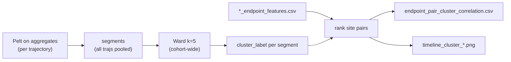
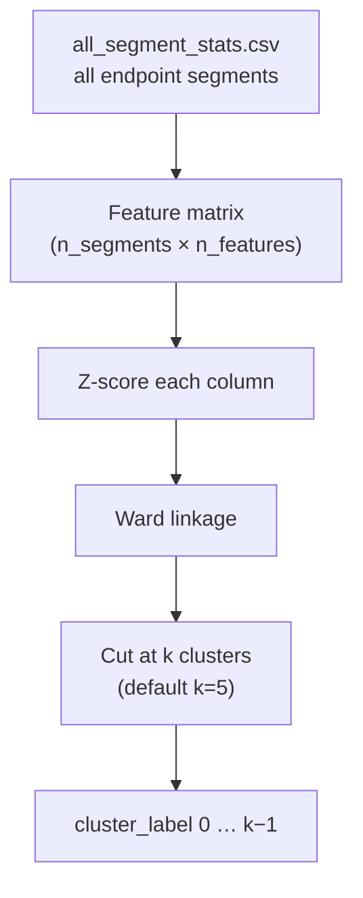

# Endpoint cluster discrimination (η², Cohen’s *d*, timeline panels)

**MD_analysis — notes for talks / writeups**  
Code: `src/ChangepointAnalysis/reporting.py` (`rank_cluster_discriminating_endpoint_features`), `src/ChangepointAnalysis/segment_clustering.py`, `src/ChangepointAnalysis/cluster_k_diagnostics.py`  
Pipeline context: [changepoint_pipeline.md](changepoint_pipeline.md)

These notes record *how* endpoint segment clusters are defined across **all trajectories in a cohort**, and *why* we rank endpoint site pairs the way we do, after finding that frame-level point-biserial correlations looked “too small” and that detection/clustering were using mismatched feature sets.

---

## 1. The question

After changepoint detection and segment clustering, we want timeline plots (`plots/timeline_cluster_*.png`) that show **chemically named contacts**, e.g. `M2S0–M5S0`, not only the assembly aggregate `endpoint_dist_mean`.

That requires a ranking: **which endpoint distances best separate the clusters we already have?**

The function does **not** invent clusters. Cluster labels come from `clusters/endpoint/segments_clustered.csv`. Ranking is a *post-hoc attribution* of those labels onto site-pair distances.



---

## 2. How endpoint clusters are defined (all samples)

This section answers: *where do `cluster_label` values come from, and what population do they describe?*

### Terminology

| Term | Meaning |
|------|---------|
| **Feature group** (`group=endpoint`) | Which changepoint / clustering problem we are in. Endpoint runs use one group; GSA runs also cluster `gsa`, `iodine`, `na_water`, `combined` separately. |
| **Segment** | One contiguous frame range in one trajectory, bounded by Pelt breakpoints. One row in `*_segment_stats.csv`. |
| **Cluster** (`cluster_label` 0…*k*−1) | A discrete metastable **endpoint geometry state** shared by segments that look similar in segment-averaged features. |
| **Sample / trajectory** | One MD replica (`traj_id`, e.g. `109345_mdcrd_v`). Many segments from many trajectories are pooled before clustering. |

Ranking (η², Cohen’s *d*, timeline panels) is **post-hoc**: it never creates clusters; it only asks which site pairs best separate labels already in `clusters/endpoint/segments_clustered.csv`.

### Cohort-wide scope (all trajectories)

Clustering is **not** per trajectory. For a given output directory (e.g. `output/endpoint_changepoints_BMMpM/`):

1. Every trajectory’s `*_segment_stats.csv` is merged into `all_segment_stats.csv`.
2. All rows with `group=endpoint` are stacked into one table.
3. **Every segment from every trajectory** becomes one point in a single feature matrix.
4. Ward hierarchical clustering runs **once** on that matrix; the dendrogram is cut at **k = 5** by default (`--n-clusters` / `--k`).

So cluster 2 in BMMpM means “segments from *any* replica whose segment-mean endpoint profile resembles other segments assigned to 2” — not “state 2 of trajectory X only.”

Code path: `cluster_all_groups` → `cluster_segment_group` in `segment_clustering.py`.

### Step 1 — Changepoints → segments (per trajectory)

Before clustering, multivariate Pelt runs on each trajectory’s endpoint feature time series (default: ~49 aggregate columns, not raw site pairs). Breakpoints split the trajectory into segments.

Each segment gets summary statistics over its frame range: for every base feature, `{base}_mean` and `{base}_std` are written to segment stats.

**Edge case:** if Pelt finds **no** breakpoints, the whole trajectory is **one segment** (`segment_id=0`). That segment still receives a `cluster_label`, but it cannot contribute to within-trajectory transition counts.

### Step 2 — Feature vector per segment (clustering input)

For `group=endpoint`, `build_segment_feature_matrix` builds one row per segment:

| Component | Columns (default) |
|-----------|-------------------|
| Assembly aggregates | `endpoint_dist_mean/std/min/max` → each as `_mean` and `_std` over the segment’s frames |
| Per-monomer-pair aggregates | Every `endpoint_dist_{i}_{j}_mean` present in the cohort → `_mean` and `_std` |
| Duration | `log10_n_frames` |

Raw site–site columns (`endpoint_dist_{i}s{a}_{j}s{b}`) are **excluded** from clustering. They enter only at the ranking / timeline stage.

Typical dimensionality: **~39 feature columns + `log10_n_frames`** (exact count depends on which pair-mean columns exist in the cohort’s feature CSVs).

### Step 3 — Hierarchical clustering



1. **Standardize** each column (z-score across all segments in the cohort).
2. **Ward linkage** on standardized vectors (`prepare_feature_clustering` → `cluster_metastable_states`).
3. **Cut** the dendrogram at fixed *k* (`fcluster`, `criterion="maxclust"`) unless `--distance-cutoff` or `--auto-select-k` is set.

Alternative *k* selection (uncommon in endpoint scripts):

| Mode | Flag | Effect |
|------|------|--------|
| Fixed *k* (default) | `--n-clusters 5` | Exactly *k* clusters |
| Distance cutoff | `--distance-cutoff` | Cut when linkage distance exceeds threshold |
| Silhouette | `--auto-select-k` | Pick *k* with best silhouette in `k_min…k_max` |

**Important:** every `output/endpoint_changepoints_B*` directory currently has five clusters because of the **fixed-k default**, not because silhouette agreed on five states. `clusters/endpoint/silhouette_by_k.csv` is inspection-only. See [§10](#10-why-every-b-run-has-five-clusters-and-why-bmmpm-differs).

Outputs under `clusters/endpoint/`: `segments_clustered.csv`, `dendrogram.png`, `pca_clusters.png`, `cluster_summary.txt`, plus cohort merges (`all_segments_clustered.csv`, `cluster_counts_by_group.csv`, transition tables).

### What `cluster_label` does *not* mean

- Labels are **arbitrary integers** from SciPy (`0…k−1`). Cluster 3 is not inherently “more open” than cluster 1.
- We do **not** hard-code paper states A / B / C1 / C2 at clustering time.
- **Open vs closed** is read **after** clustering from mean distances, RMSD overlays, and Cohen’s *d* on ranked site pairs — not from the label number itself.

### Post-hoc chemical interpretation

After clusters exist, summarize / inspection steps attach meaning:

| Artifact | Use |
|----------|-----|
| `endpoint_cluster_deformation_summary.csv` | Order clusters by mean `endpoint_dist_mean` (larger ≈ more deformed / open assembly) |
| `endpoint_pair_cluster_correlation.csv` | Rank site pairs by segment-level η² vs `cluster_label` |
| `plots/timeline_cluster_{k}_{traj}.png` | Medoid segment timelines for cluster *k* |
| `transitions/endpoint/` | Which clusters each trajectory visits over time |
| Optional `--rmsd-from` | Compare cluster mean RMSD to paper peaks (~1.0 / 1.5 / 1.6–2.5 / 2.7 Å) |

**Short summary for slides:** *Clusters = Ward groups of segment-mean endpoint profiles, learned once on all replicas; labels are structural IDs; chemistry comes from post-hoc distance / η² / RMSD reading.*

---

## 3. Why frame-level |r| looked too small

Early ranking used **point-biserial correlation of frames vs one-vs-rest cluster membership**.

On BMMpM-scale data that gave max |r| ≈ 0.28 for the best site pair. That is **not** a weak chemical signal. It is an attenuated statistic:

| Cause | Effect |
|-------|--------|
| Clusters are assigned to **segments** | Frame-level r mixes within-segment noise into the score |
| One-vs-rest binarization | A pair that separates cluster 2 from 4 looks average vs “everything else” |
| Autocorrelation | ~50k frames but hundreds of independent segments; *p*-values are meaningless |
| 960 candidates | Selection without a calibrated null |

Ceiling check: the **same clustering features** that define the clusters only reached frame-level max |r| ≈ 0.39–0.43. So 0.28 was ~70% of that metric’s ceiling.

**Fix:** score at **segment level** with η² (and Kruskal–Wallis ε² as a robustness column).

A second bug: **per-trajectory z-scoring of segment means** wiped out absolute Å differences that actually distinguish clusters (open vs closed cages across replicas). Ranking now uses **raw Å** segment means. Frame-level |r| is still z-scored per traj, but only as a comparison column (`frame_max_abs_corr`).

---

## 4. Feature sets must match the stage

Raw `endpoint_dist_{i}s{a}_{j}s{b}` columns (~960) are highly redundant (~26 PCs for 80% of variance). Feeding all of them into Pelt after z-score overweighted a few collective modes.

| Stage | Features (default) | Why |
|-------|--------------------|-----|
| **Detect** | Assembly + per-monomer-pair aggregates (~49 cols) | Avoid 960 redundant site pairs |
| **Cluster** | Assembly aggregates + every `endpoint_dist_{i}_{j}_mean` mean/std (~39 dims + `log10_n_frames`) | Clusters must encode *which* face deformed |
| **Rank / plot** | Raw site pairs when present; else pair means | Named contacts for slides |

`--include-site-pairs-in-detection` restores the old 1009-column detection matrix.

Evidence (same 565 segments, same breakpoints, only clustering features changed):

| Clustering features | dims | site-pair η² max |
|---------------------|------|-------------------|
| Assembly aggregates only | 9 | 0.37 |
| + per-monomer-pair aggregates | 39 | **0.83** |

After the aligned pipeline, BHHpM / BMMpM top pairs sit near **η² ≈ 0.81–0.84**.

---

## 5. What `rank_cluster_discriminating_endpoint_features` does

Location: `src/ChangepointAnalysis/reporting.py`.

### Inputs

- `changepoints_dir` — clustered segments
- `features_dir` — `*_endpoint_features.csv`
- `group="endpoint"`
- optional in-memory `clustered_df`

### Guards (empty table → no CSV, fallback panels)

1. Need `traj_id`, `cluster_label`, `start_frame`, `end_frame`
2. Need ≥ 2 clusters, each with ≥ 2 segments
3. Need at least one features CSV with candidate columns

### Column discovery

Prefer raw site–site distances:

`endpoint_dist_{i}s{a}_{j}s{b}` → label **`MiSa-MjSb`** (e.g. `M2S0-M5S0`)

Else monomer-pair means:

`endpoint_dist_{i}_{j}_mean` → `Mi-Mj pair mean`

### Two tracks

**Track A (ranking) — segment, raw Å**

For each clustered segment, `nanmean` of the feature over `[start_frame, end_frame]`.  
One row per segment. **No per-traj z-score.**  
Matrix `X` is `(n_segments, n_features)` with labels `y`.

**Track B (diagnostic only) — frame, z-scored per traj**

Pooled point-biserial of z-scored frames vs one-vs-rest membership → `frame_max_abs_corr`.

---

## 6. η² (primary sort key)

Classic one-way ANOVA effect size on **segment means**:

η² = SS_between / SS_total

Where:

- SS_total = Σᵢ (xᵢ − x̄)²
- SS_between = Σ_c n_c (x̄_c − x̄)²

**SS_total** is the sum of squared deviations of all segment means from the grand mean (how much total variance there is).  
**SS_between** is the sum of squared deviations of each cluster's mean from the grand mean, weighted by number of segments in each cluster (variance explained by clustering).

**η²** is the fraction of total variance in segment means explained by the cluster labels.

Code: `_eta_squared`.

| η² | Talk track |
|----|------------|
| 0 | Cluster labels tell you nothing about this pair |
| 1 | All variation is between clusters |
| ~0.81 | ~81% of segment-to-segment variance in that pair is between clusters |

η² is **unsigned**. It does not say open vs closed.  
It is **not** a correlation. \(\sqrt{\eta^2}\) is roughly a multiple \(R\).  
It is not ω² / partial η² (no residual-df correction; slightly optimistic with few segments).

Robustness column: Kruskal–Wallis ε² = \((H - k + 1)/(n - k)\) on the same segment means (`epsilon_squared_kw`).

---

## 7. Cohen’s *d*: why it can mean open / closed

The feature is a **distance in Å**, so the sign of *d* has a geometric meaning.

For cluster \(c\):

\[
d_c = \frac{\overline{x}_c - \overline{x}_{\mathrm{rest}}}{s_{\mathrm{pooled}}}
\]
where:
- \(\overline{x}_c\) = mean for cluster \(c\)
- \(\overline{x}_{\mathrm{rest}}\) = mean for all other segments not in \(c\)
- \(s_{\mathrm{pooled}}\) = pooled standard deviation (across both groups)

| \(d_c\) | Meaning **for that pair** |
|---------|---------------------------|
| \(d > 0\) | Cluster \(c\) has a **larger** mean distance than the rest → **more open** |
| \(d < 0\) | Cluster \(c\) has a **smaller** mean distance → **more closed** |
| \(\lvert d \rvert\) | Size of that opening/closing, in pooled SD |

### The loop that picks `best_cluster`

```python
for c in cluster_ids:
    d = _cohens_d_one_vs_rest(xj, y == c)
    if abs(d) > best_abs:
        best_d, best_c = d, c
```

Cluster membership `y` is **already known**. This loop does **not** assign segments to clusters.

For **one feature** `xj` it asks: *which cluster’s mean distance is most different from all the others?*

- `best_cluster = 2`, `cohens_d_best = +1.8` → this pair is most distinctive in cluster 2, and that cluster is more **open**
- `best_cluster = 0`, `cohens_d_best = −1.2` → most distinctive in cluster 0, more **closed**

Division of labour:

| Statistic | Question |
|----------|----------|
| η² | Does this pair vary across clusters at all? (rank panels) |
| Cohen’s *d* + `best_cluster` | In the state it marks, is that pair stretched or compressed? |

### Caveats (say this on the slide)

- Open/closed is **relative to the other clusters**, not vs a crystal structure or the paper 4.5–5.5 Å cation–π window.
- It is **one pair**, not a global cage state. `M2S0–M5S0` can be open while another face is closed.
- Paper A / B / C1 / C2 still need RMSD / paper-d1, not *d* alone.

---

## 8. Output and where to look

Filename is **`endpoint_pair_cluster_correlation.csv`**, next to `all_breakpoints.csv` (not under `plots/`).

Written only during **summarize**, when:

1. Cluster medoid timelines are not skipped
2. `--timeline-top-pairs` > 0 (default 5)
3. `clusters/<group>/cluster_representatives.csv` exists
4. Ranking returns a non-empty table

Columns: `feature`, `endpoint_label`, `eta_squared`, `epsilon_squared_kw`, `cohens_d_best`, `best_cluster`, `frame_max_abs_corr`, `rank`. With the G4 permutation null (default 999 shuffles): also `eta_squared_p_value`, `eta_squared_q_value`, `n_permutations`, `significant_fdr`.

Timeline labels look like:

`M2S0-M5S0 (Å)  η²=0.81`

First panel is still `endpoint_dist_mean` (assembly reference).

Regenerate on an existing result dir:

```powershell
python scripts/summarize_changepoint_results.py `
  --changepoints-dir output/endpoint_changepoints_BHHpM `
  --features-dir output/endpoint_changepoints_BHHpM/endpoint_features `
  --features-suffix "_endpoint_features.csv" `
  --skip-tables `
  --skip-individual-timelines `
  --timeline-top-pairs 5
```

---

## 9. Suggested slide outline

1. **Clusters.** Ward on **all** segment means (cohort-wide, default *k*=5); labels are not paper A/B/C1/C2.
2. **Problem.** Frame-level |r| ≈ 0.28 looks weak; it is a unit mismatch (frames vs segments).
3. **Ceiling.** Clustering features themselves only reach |r| ≈ 0.4 at frame level.
4. **Alignment.** Detect on ~49 aggregates; cluster on ~39 pair aggregates; rank raw site pairs.
5. **Statistic.** Segment-level η² ≈ 0.81 for top contacts (variance explained by cluster).
6. **Direction.** Cohen’s *d* on the same Å distances: + open, − closed, relative to other clusters.
7. **Figure.** `timeline_cluster_*.png` + table from `endpoint_pair_cluster_correlation.csv`.
8. **Limit.** Named pairs ≠ paper motif labels; use RMSD / paper-d1 for A/B/C1/C2.
9. **k is shared, not fitted.** All B\* cubes are cut at k=5 for comparability; silhouette prefers k=6 only for BHHpM, k=2 for most others, and has **no unique cut** on BMMpM.
10. **GSA analogue.** On `gsa_features_step1`, Pelt switches ~20–35 times/traj; BHHpM is not a k=6 candidate; BMMpM is quieter but not frozen.

---

## 10. Why every B* run has five clusters, and why BMMpM differs

Regenerate tables and figures from existing cohort dirs (no re-detect / re-cluster):

```powershell
python scripts/compare_endpoint_cluster_k.py `
  --output-root output `
  --pattern "endpoint_changepoints_B*" `
  --exclude-test `
  --out-dir output/endpoint_cluster_k_diagnostics
```

Logic: `src/ChangepointAnalysis/cluster_k_diagnostics.py`.  
Artifacts: `output/endpoint_cluster_k_diagnostics/` (`silhouette_peaks.csv`, `segment_dynamics.csv`, `site_and_d1.csv`, `k_split.csv`, `k_diagnostics_summary.txt`, `plots/`).

### k=5 is a CLI cut, not a silhouette result

`SegmentClusteringConfig.n_clusters = 5`. `--auto-select-k` is off. Ward builds one dendrogram per cube; `fcluster(..., criterion="maxclust")` is forced to five groups so BHH / BMH / BMM remain comparable. That is why **every** `endpoint_changepoints_B*` folder has cluster labels `0…4`.

Silhouette is scored afterward on the z-scored ~40-D pair-mean distance matrix. Scores around 0.16–0.22 are normal in that space. The curve does **not** pick k unless you pass `--auto-select-k` (do not: see below).


| Cohort | n seg | k=2 | k=5 | k=6 | Global max | Curve | What k=6 does |
|--------|------:|----:|----:|----:|------------|-------|---------------|
| BHHpM | 365 | 0.166 | 0.203 | **0.217** | **k=6** | `global_peak_k6` | splits 81 → 48+33 |
| BHHpH | 585 | **0.304** | 0.166 | 0.171 | k=2 | `k2_global_local_k6` | peels 5 off a 50-seg cluster |
| BMHpM | 369 | **0.342** | 0.193 | 0.204 | k=2 | `k2_global_local_k6` | peels 9 off a 76-seg cluster |
| BMMpM | 134 | 0.298 | 0.363 | 0.383 | k=10 (rising) | `increasing` | splits 14 → 7+7 |
| BMHpH | 356 | **0.917** | 0.214 | 0.207 | k=2 | `k2_global` | two singleton outliers vs bulk |
| BMMpH | 187 | **0.509** | 0.167 | 0.168 | k=2 | `k2_global` | coarse binary split |

BHHpM is the only cube whose *global* silhouette maximum is k=6, and the split is balanced. BHHpH / BMHpM have a weak local bump at k=6 after k=2 already won. Auto-silhouette would pick **k=2** for four of six cubes — too coarse for named contacts — and BMHpH’s 0.92 is an outlier trap (clusters of size 1 at 19 Å and 30 Å).

### Why BMMpM’s silhouette keeps rising

Three stacked causes. BMMpM is not a noisier BHHpM; the paper cation–π coordinate never opens, so Pelt barely switches and Ward slices a nested packing continuum.


**1. Hull-index d1 was the wrong contact; paper d1 never enters 4.5–5.5 Å on BMM (old CSVs)**


The table below is the **old hull-order run** (do not treat `s3`/`s7` as R2/R3). Canonical QC is now `output/endpoint_changepoints_{CUBE}/endpoint_features/endpoint_sites.png`: eight fixed roles, blue = ring, orange = atom **painted on top** so R=H para carbons (R1 / R2 / R3 / Ph-p) stay orange on their blue rings.

| Cube | Old hull look | Old `s3` / `s7` | paper-d1 min (hull) | segs with any open pair |
|------|------|-------------|--------------|-------------------------|
| BHHpH / BHHpM | ring-majority | both 6-atom **ring** | ~4.4 Å | 96–98% |
| BMHpH / BMHpM | mixed 4+4 | one ring, one atom | ~4.9 Å | 70–81% |
| BMMpH | mixed 4+4 | one ring, one atom | ~9.8 Å | **0%** |
| **BMMpM** | **atom-majority (62%)** | **both singleton atoms** | **~9.4 Å** | **0%** |

**Site-map bug (fixed in code; numbers above are the hull run).** Hull-order `s3`/`s7` were not R2/R3. BMHpM vs BMMpH both showed 4 ring + 4 atom so the maps looked symmetric, but `s3` was the bottom phenyl on BMHpM and an inner ring on BMMpH — that is why d1 was ~4.9 Å vs ~9.8 Å.

**Remapped equatorial d1** (stored `endpoint_dist_*` columns → canonical R2(i)–R3(j), six edges, no traj replay). Quote these instead of the hull table. Details: [changepoint_pipeline.md](changepoint_pipeline.md#remap-stored-pairs--murata-equatorial-d1).


| Cube | Median d1 (Å) | Compact 4.5–5.5 | Elongated ≥ 7 | Stored pair |
|------|---------------|-----------------|---------------|-------------|
| BHHpH | 4.97 | 77% | 10% | R2/R3 aryl (H) |
| BHHpM | 4.99 | 75% | 14% | R2/R3 aryl (H) |
| BMHpH | 5.04 | 37% | 8% | R2 aryl – R3 methyl |
| BMHpM | 5.06 | 37% | 8% | R2 aryl – R3 methyl |
| BMMpH | 4.30 | 27% | 0.3% | methyl–methyl |
| BMMpM | 4.33 | 27% | 2% | methyl–methyl |

BHHpH / BHHpM now sit in Murata's compact window (plus an 8–9 Å elongated shoulder). BMH / BMM are **methyl-carbon** proxies, ~0.7 Å short of C2–C3; do not treat their compact fractions as Murata d1 until ipso–ipso is re-extracted. Edges are the same 6-cycle on every cube (0→4, 1→5, 2→3, 3→1, 4→2, 5→0).

On the old hull CSVs the d1 step-inward *does* fire on BMMpM (`endpoint_atom ≠ d1_ring_atom`) but those atoms were R1+R3, so distances stayed ~10–17 Å. BHHpM’s top η² contacts are ring-face openings (`M2S0–M5S0`); BMMpM’s are methyl-site packings (`M2S2–M3S3`).

**2. Trajectories almost do not switch**

| | BHHpM | BMMpH | **BMMpM** |
|---|---:|---:|---:|
| segments | 365 | 187 | **134** |
| segments / traj | 7.3 | 3.7 | **2.6** |
| breakpoints | 315 | 137 | **83** |
| whole-trajectory segs | 0% | 12% | **41%** |
| trajs that never change cluster | 6% | 20% | **55%** |
| mean segment length (frames) | 137 | 267 | **373** |

About half of BMMpM replicas never leave one cluster, so clustering is largely **across replicas**.

**3. No unique cut in the segment cloud**

Assembly `endpoint_dist_mean` range is 0.91 Å on BMMpM vs 1.60 Å on BHHpM (BMHpH’s 13 Å range is two singleton outliers; IQR is ~0.4 Å like the others). Cluster 0 is a tight 67-segment blob (std 0.07 Å). Ward then bisects small compact leaves (k=6: 14 → 7+7), and silhouette rewards that compactness all the way to k=10.

High η² (~0.84) does not contradict this. η² is computed **after** k=5 is forced (“do these labels separate this pair?”). Silhouette asks whether there is a unique number of blobs. For BMMpM the answer is no.

**Talk track:** treat BMMpM clusters as subtle packing variants across replicas, not A→B→C1→C2. If you move one cube, BHHpM → k=6 is the only data-driven candidate; `clusters/endpoint/by_k/k_06/` already has those labels.

The same k-cut / silhouette / switching comparison on cage GSA features is §11 (`output/gsa_features_step1`).

---

## 11. GSA cage-geometry k-diagnostics (`gsa_features_step1`)

Same question as §10, but on **cage GSA features** (`assembly_rg`, RMSD-to-ref, octahedrality, contacts, …) instead of endpoint-site distances. `output/gsa_features_step1` mixes all B\* cubes (BMHpM lives in a subdirectory), so each cube is staged and clustered **separately** — do not dump the mixed folder into one `ChangepointPipeline`.

```powershell
python scripts/run_gsa_step1_cluster_k.py `
    --features-dir output/gsa_features_step1 `
    --output-root output `
    --out-dir output/gsa_cluster_k_diagnostics `
    --workers 6
```

Re-compare existing `gsa_changepoints_B*` dirs without re-detecting:

```powershell
python scripts/compare_endpoint_cluster_k.py `
    --group gsa `
    --output-root output `
    --pattern "gsa_changepoints_B*" `
    --out-dir output/gsa_cluster_k_diagnostics
```

Logic: `compare_cluster_k_diagnostics(..., group="gsa")`.  
Artifacts: `output/gsa_cluster_k_diagnostics/` and per-cube `output/gsa_changepoints_{CUBE}/clusters/gsa/`.  
Detection uses `--groups gsa` only (skip iodine / na_water / combined) so the analogue of the endpoint group is cage geometry. Existing `output/changepoints` is an older BMMpM-only ~500-frame run; it is **not** this step-1 cohort.

### k=5 is still a CLI cut

Ward is forced to five groups, same as endpoint. Silhouette on the z-scored GSA segment matrix is inspection-only. Scores at k=5 are **lower** than endpoint (0.05–0.22 vs 0.16–0.36) because Pelt cuts ~51 noisy cage columns into **many** short segments (~20–35 per traj vs 3–12 on endpoint).


| Cohort | n seg | segs/traj | k=2 | k=5 | k=6 | Global max | Curve | k=5→6 Ward split |
|--------|------:|----------:|----:|----:|----:|------------|-------|------------------|
| BHHpH | 1601 | 32.0 | **0.148** | 0.049 | 0.056 | k=2 | `k2_global` | 405 → 222+183 |
| BHHpM | 1742 | 34.8 | **0.136** | 0.076 | 0.065 | k=2 | `k2_global` | 777 → 400+377 |
| BMHpH | 1494 | 29.3 | **0.936** | 0.223 | 0.223 | k=2 | `k2_global` | 3 → 2+1 (tiny peel) |
| BMHpM | 1440 | 28.8 | 0.211 | 0.153 | 0.112 | **k=3** | `global_peak_k3` | 480 → 355+125 |
| BMMpH | 1140 | 22.8 | **0.422** | 0.143 | 0.121 | k=2 | `k2_global` | 588 → 383+205 |
| BMMpM | 979 | 19.2 | **0.334** | 0.156 | 0.136 | k=2 | `k2_global` | 198 → 138+60 |

Auto-silhouette would pick **k=2** for five of six cubes. BMHpH’s 0.94 is the same **outlier trap** as on endpoint: clusters of size 3 and 1 are exploded-cage fragments of `BMHpH_563849` (Rg 13–29 Å, RMSD up to 25 Å). The bulk of BMHpH sits at Rg ≈ 10.3–10.8 Å; IQR of segment Rg is 0.33 Å, in line with the other cubes. Prefer **IQR** over range when quoting geometry span.

BHHpM is **not** a k=6 candidate on GSA (unlike endpoint). BMHpM is the only cube whose global max is not k=2 (k=3, then the score falls).

### GSA Pelt switches far more than endpoint — BMMpM is no longer “frozen”


| Cohort | segs/traj (GSA) | segs/traj (endpoint) | whole-traj frac (GSA) | Rg IQR (Å) | endpoint-dist IQR (Å) |
|--------|----------------:|---------------------:|----------------------:|-----------:|----------------------:|
| BHHpH | 32.0 | ~12 | 0 | 0.27 | 0.35 |
| BHHpM | 34.8 | ~7 | 0 | 0.20 | 0.24 |
| BMHpH | 29.3 | ~7 | 0 | 0.33 | 0.26 |
| BMHpM | 28.8 | ~7 | 0 | 0.29 | 0.14 |
| BMMpH | 22.8 | ~4 | 0 | 0.14 | 0.23 |
| BMMpM | 19.2 | **2.6** | **0** | 0.33 | 0.31 |

Zero trajectories are a single GSA segment. BMMpM still has the **fewest** GSA breakpoints (~19/traj, longest mean segment 255 frames), so the methyl cube is quieter in cage space too — but that is a **relative** difference, not the near-static 2.6 segs/traj seen on endpoint. Silhouette on GSA BMMpM **does not keep rising** with k (`k2_global`, falling after k=2). The “no unique cut / nested packing” story is endpoint-specific.


Mean octahedrality is highest on BMMpH (0.95) and BMMpM (0.94); BHH cubes sit lower (~0.87–0.88), consistent with more deformed cages. Mean `endpoint_dist` from the GSA columns is largest on BMMpM (16.65 Å vs ~15.3–16.0 Å), the same elongated packing seen in paper-d1.

**Talk track:** k=5 is still a shared cut, not a silhouette result. On GSA, do not promote BHHpM to k=6. BMHpH k=2 is one exploded replica. BMMpM is the least-switching cage cohort but still has ~19 segments/traj; use endpoint (not GSA) if you need the “almost no Pelt switching” argument.

### Iodine / na_water / combined (same cubes)

Added incrementally on top of the `gsa` tables (`--groups iodine na_water combined`; existing `gsa` rows are kept). Artifacts: `output/{iodine,na_water,combined}_cluster_k_diagnostics/`.

| Group | segs/traj | Silhouette at k=5 | Who wins k? | BMMpM vs others |
|-------|-----------|-------------------|-------------|-----------------|
| gsa | 19–35 | 0.05–0.22 | k=2 for five cubes | fewest switches (19.2) |
| iodine | **27–30** (flat) | 0.15–0.29 | k=3–7; **k=5 for BMHpM / BMMpH** | **not quieter** (28.7) |
| na_water | 10–14 | 0.11–0.14 | k=5 for BHH; k=2 for BMHpM / BMMpM | fewest switches (9.6) |
| combined | 16–29 | 0.14–0.20 | k=2 for BMH/BMM; k=4 for BHH/BMHpM | fewest switches (15.8) |

Iodine occupancy barely moves (`n_guest_inside_cavity` range ≈ 1). Guest Pelt cuts are occupancy/contact flicker, not cage opening, which is why every cube has ~28 iodine segments/traj. Combined follows GSA (including the BMHpH exploded-cage k=2 trap, silhouette 0.90). na_water is the coarsest of the four GSA-feature groups.

```powershell
python scripts/run_gsa_step1_cluster_k.py --groups iodine na_water combined --workers 6
```

---

## 12. G4 — permutation null and BH-FDR on the ranking

η² cannot *validate* the clusters. They are Ward groups of per-monomer-pair aggregates; ranking then scores site pairs that are linear pieces of those same aggregates. Section 4's jump from η² max 0.37 → 0.83 when pair means entered clustering is that circularity.

What G4 adds is a **calibrated ranking**, not a cluster test:

1. Build the segment-mean matrix *X* (raw Å) as before.
2. Shuffle `cluster_label` *B* times (default 999), preserving cluster sizes.
3. For each feature, *p* = (1 + #{η²_perm ≥ η²_obs}) / (*B* + 1).
4. Benjamini–Hochberg *q* across the ~960 candidate columns; `significant_fdr` is *q* ≤ 0.05.

Columns on `endpoint_pair_cluster_correlation.csv`: `eta_squared_p_value`, `eta_squared_q_value`, `n_permutations`, `significant_fdr`. Disable with `--ranking-n-permutations 0`.

Quote η² as "fraction of segment-mean variance associated with these labels, with a permutation *p* against chance assignment." Do not quote it as evidence that the clusters are real states.

---

## 13. G3 — chemical separation vs k (not one "correct" k)

Silhouette's global max is k=2 for most endpoint cohorts (§10). That is geometric compactness, not chemistry. G3 asks, **per cube, per k in 2–10**, whether the existing `by_k/` labels produce distinct driving contacts or mixed open/closed Cohen's *d* signs, with clusters of size ≥ 5 (so BMHpH k=2's singleton outliers do not count).

```powershell
python scripts/compare_endpoint_cluster_k.py `
  --chemical-scan `
  --output-root output `
  --pattern "endpoint_changepoints_B*" `
  --exclude-test `
  --out-dir output/endpoint_cluster_chemical_k
```

| Flag | Meaning |
|------|---------|
| `chemical_separation` | Top-10 pairs mark ≥2 usable clusters with distinct `endpoint_label` **or** mixed *d* signs |
| `chemical_separation_fdr` | Same test on BH-significant pairs only (stricter; 960 tests need many hits at the *p*-floor) |
| `first_chemical_k` | Smallest k that passes `chemical_separation` |
| `best_chemical_k` | Passing k with the most marked clusters, then FDR hits |

Different cubes need not share a k. Results from the published-penalty scan (`output/endpoint_cluster_chemical_k/`):

| Cohort | Silhouette max | first_chemical_k | Chemical at k=5? |
|--------|----------------|------------------|------------------|
| BHHpH | k=2 | **3** | yes |
| BHHpM | k=6 | **3** | yes |
| BMHpH | k=2 (outlier trap) | **5** | yes |
| BMHpM | k=2 | **5** | yes |
| BMMpH | k=2 | **3** | yes (window k=3–5 only) |
| BMMpM | rising to k=10 | **4** | yes (also 6, 9) |

Silhouette-max k=2 never has chemical_separation. Default k=5 does, in every cube. BMMpM is not empty of discrete cuts — it first splits at k=4 on methyl-site packings (`M2S2–M3S3` at k=5) — but silhouette keeps climbing while chemistry is intermittent.

This scan uses **published-penalty** `by_k/` labels. Own-elbow detections were not re-clustered.

---

## 14. Related code

| Piece | Where |
|-------|--------|
| Segment clustering | `cluster_segment_group`, `build_segment_feature_matrix` (`segment_clustering.py`) |
| Ward / dendrogram cut | `cluster_metastable_states`, `prepare_feature_clustering` (`metastable_states.py`) |
| Clustering feature columns | `summary_base_columns`, `summary_feature_columns` (`feature_groups.py`) |
| Ranking | `rank_cluster_discriminating_endpoint_features` |
| Alias | `rank_cluster_correlated_pair_means` |
| η² | `_eta_squared` / `_eta_squared_columns` |
| Permutation *p* / BH *q* | `permutation_eta_squared_pvalues`, `benjamini_hochberg_qvalues` |
| Chemical k-scan | `scan_chemical_separation_by_k`, `assess_chemical_separation` |
| KW ε² | `_epsilon_squared_kw` |
| One-vs-rest *d* | `_cohens_d_one_vs_rest` |
| Panel labels | `cluster_correlated_timeline_panels` |
| Deformation summary | `compare_endpoint_clusters_to_deformation` |
| Write CSV | `summarize_changepoint_results` (~line 1196) |
| Detection aggregates | `feature_groups.py` (`endpoint_aggregate_columns`) |
| k / silhouette diagnostics | `compare_cluster_k_diagnostics` / `compare_endpoint_cluster_k_diagnostics` (`cluster_k_diagnostics.py`) |
| CLI | `--n-clusters`, `--timeline-top-pairs`, `--include-site-pairs-in-detection` |
| Canonical GSA site map | `src/EndpointAnalyzer/gsa_site_map.py` (`CANONICAL_ROLES`, `endpoint_sites.png` labels) |
| Murata d1 remap | `remap_endpoint_cohort_d1` (`murata_d1.py`); CLI `scripts/remap_murata_d1.py` |
| k-diagnostics CLI | `scripts/compare_endpoint_cluster_k.py` (`--group endpoint` or `gsa`; `--chemical-scan` for G3) |
| GSA step-1 per-cube run | `scripts/run_gsa_step1_cluster_k.py` (`gsa_cohort_run.py`) |
