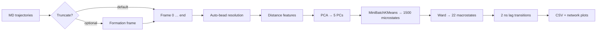
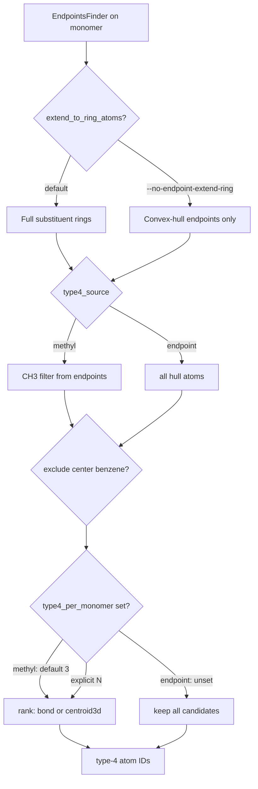

# Imamura Nanocube MSM Workflow

**MD_analysis implementation summary**  
*Based on Imamura, Yamamoto & Sato, Chem. Phys. Lett. **742**, 137135 (2020)*

---

## Motivation

Reproduce the Imamura group's Markov-state-style analysis of **GSA nanocube** trajectories inside this repository:

- Use existing **MDAnalysis**, **RDKit**, **GSA selections**, and **cluster inspection** utilities
- Provide a single CLI script for batch analysis
- Support **all-atom GSA** systems (e.g. BMMpM) via automatic bead picking

---

## Reference Pipeline (Imamura et al.)

| Step | Description | Default in this repo |
|------|-------------|----------------------|
| 1 | Truncate trajectories at nanocube formation | **Off** (opt-in via `--truncate-at-formation`) |
| 2 | Build sorted inter-bead distance feature vector per frame | ✓ (dim depends on bead count) |
| 3 | **PCA** → 5 components | ✓ |
| 4 | **MiniBatchKMeans** (1500) → **Ward** merge (22 states) | ✓ |
| 5 | **2 ns** lagged transition network | ✓ |

---

## Feature Vector Construction

For each trajectory frame:

### Type-1 beads — central benzenes (6 beads → 15 distances)

- One bead per monomer = **geometric center** of the central benzene ring
- Ring identified with `RingCenterCalculator.find_center_benzene_ring()`
- All unique pairwise distances computed, **sorted descending** → **v₁** (15 values)

### Type-4 beads — substituent endpoints (variable count)

Candidates come from `EndpointAnalyzer` / `EndpointsFinder`, then filtered and ranked per monomer.

| Mode | Default beads / monomer | BMMpM example (hull, no ring expand) |
|------|-------------------------|--------------------------------------|
| `--type4-source methyl` | **3** (18 total) | 3 methyl carbons per arm |
| `--type4-source endpoint` | **all hull atoms** | **12** per monomer → **72** total |

Sorted descending pairwise distances → **v₄**.

**Paper default (methyl):** 15 + 153 = **168 dimensions**.

**Endpoint hull (BMMpM):** 15 + C(72, 2) = 15 + 2556 = **2571 dimensions**.  
`n_type4_beads` is **auto-synced** from the resolved `bead_spec` when using `--auto-beads`.

### Type-4 source (`--type4-source`)

| Value | Candidate pool | Default count |
|-------|----------------|---------------|
| `methyl` (default) | Endpoint-linked `[CH3]` carbons | 3 per monomer (`--type4-per-monomer`, default 3) |
| `endpoint` | Raw `EndpointsFinder` hull atoms (minus central ring if excluded) | **All** candidates unless `--type4-per-monomer N` is set |

### Type-4 ranking (`--type4-rank`)

Applied when trimming to `--type4-per-monomer` (or for methyl mode, which always caps at 3):

| Rank | Rule |
|------|------|
| `bond` (default) | Bond-graph distance from central benzene — **nearest** substituents for `methyl`, **outermost** for `endpoint` |
| `centroid3d` | 3D distance from central ring centroid — keep the **farthest** *N* candidates |

### Endpoint discovery knobs

| Option | Default | Effect |
|--------|---------|--------|
| `--endpoint-extend-ring` | on | Expand hull hits to full substituent rings |
| `--no-endpoint-extend-ring` | | Hull endpoints only (no ring expansion) |
| `--endpoint-exclude-center-benzene` | on | Drop central benzene atoms from endpoint type-4 |
| `--no-endpoint-exclude-center-benzene` | | Allow central ring atoms as type-4 beads |
| `--type4-per-monomer N` | unset | Cap type-4 per monomer; **methyl defaults to 3**; **endpoint keeps all** when unset |

### Combined feature

```
v_f = [v₁ | v₄]
```

---

## Pipeline Architecture



---

## New Repository Components

| File | Role |
|------|------|
| `src/utils/imamura_msm.py` | Core workflow: beads, features, PCA, clustering, transitions, plots; `ImamuraBeadResolutionOptions` |
| `scripts/run_imamura_msm.py` | CLI entry point |
| `src/utils/rdkit_utils.py` | `select_type4_by_bond_distance`, `select_type4_by_centroid_distance`, methyl/endpoint filters |

Reuses:

- `src/utils/gsa_selections.py` — monomer selections
- `src/utils/cluster_inspection.py` — transition heatmaps & network diagrams
- `src/TrajectoryIterator` — single-pass frame iteration

---

## Auto-Bead Selection (`--auto-beads`)

Per monomer (6 × MOL residues):

| Bead type | Method | Color in `auto_beads.png` |
|-----------|--------|---------------------------|
| **Type-1** | Central benzene ring → centroid each frame | **Green** |
| **Type-4** | Methyl filter **or** raw endpoints (see `--type4-source`) | **Orange** |

Central benzene atoms are **never** type-4 when `--endpoint-exclude-center-benzene` is on (default).  
Orange on outer benzene ring carbons in endpoint mode is expected — those are hull endpoints, not the type-1 centroid ring.

### Type-4 resolution flow



### `auto_beads.png` visualization

- Per-monomer 2D structure with green (type-1) and orange (type-4) atom highlights
- Uses `rdkit.Chem.Draw.rdMolDraw2D` for per-atom colors (green ≠ orange)
- Text labels: `T1:<mda_id>` (green), `T4:<mda_id>` (orange)

Artifacts written at bead resolution:

- `bead_spec.json` — ring groups, type-4 atom IDs, `type4_source`, `type4_rank`, `endpoint_extend_ring`, `endpoint_exclude_center_benzene`
- `auto_beads.png` — visual QC before clustering

Alternative: `--bead-mode cg` for coarse-grained bead names (`B1`, `B4`).

---

## Formation Detection — Design Choice

### Imamura paper

Trajectories were truncated at the moment the nanocube **finished assembling**.

### Our trajectories (BMMpM)

**Already start as assembled nanocubes** → truncation is **disabled by default**.

### Bug found & fixed

Strict criterion `n_active_interfaces ≥ 15` failed at frame 0:

| Metric @ frame 0 (BMMpM) | Value |
|--------------------------|-------|
| Active interfaces (4.5 Å) | **12 / 15** |
| Largest connected component | **6 / 6** |
| Contact graph density | 0.80 |

The cage is connected and assembled, but not all 15 atom-pair interfaces exceed 4.5 Å.

### New logic (`is_nanocube_assembled`)

Assembly detected when **either**:

1. All monomers in one contact component (`LCC ≥ n_monomers`) → **returns frame 0** for pre-assembled trajectories  
2. `n_active_interfaces ≥ threshold` (strict 15/15 mode)

---

## Command-Line Usage

### Standard run (Imamura paper style, methyl type-4)

```bash
python scripts/run_imamura_msm.py \
  --topology traj/BMMpM_ca.prmtop \
  --trajectories traj/BMMpM_891249_mdcrd_v.trj \
  --format TRJ \
  --auto-beads --gsa-resname MOL \
  --dt-ps 2.0 \
  --output-dir output/imamura_msm
```

### Endpoint hull type-4 (all hull atoms, 72 beads on BMMpM)

```bash
python scripts/run_imamura_msm.py \
  --topology traj/BMMpM_ca.prmtop \
  --trajectories traj/BMMpM_891249_mdcrd_v.trj \
  --format TRJ \
  --auto-beads --gsa-resname MOL \
  --type4-source endpoint \
  --no-endpoint-extend-ring \
  --type4-rank bond \
  --dt-ps 2.0 \
  --output-dir output/imamura_msm/endpoint_BMMpM
```

`n_type4_beads` adjusts automatically (18 → 72). Feature dimension becomes 2571.

### Cap endpoint mode back to 3 per monomer (paper-like count)

```bash
python scripts/run_imamura_msm.py \
  ... --auto-beads --type4-source endpoint --no-endpoint-extend-ring \
  --type4-per-monomer 3 --type4-rank centroid3d
```

### Assembly trajectories (Imamura-style truncation)

```bash
python scripts/run_imamura_msm.py \
  ... \
  --truncate-at-formation
```

### Key flags

| Flag | Default | Purpose |
|------|---------|---------|
| `--auto-beads` | off | RDKit benzene + configurable type-4 bead resolution |
| `--type4-source` | `methyl` | `methyl` (CH3 filter) or `endpoint` (raw EndpointsFinder) |
| `--type4-rank` | `bond` | `bond` or `centroid3d` when trimming to N beads |
| `--type4-per-monomer` | unset | Cap per monomer; methyl→3; endpoint→all when unset |
| `--endpoint-extend-ring` | on | Expand endpoint hits to substituent rings |
| `--no-endpoint-extend-ring` | | Hull endpoints only |
| `--endpoint-exclude-center-benzene` | on | Drop central benzene from endpoint type-4 |
| `--no-endpoint-exclude-center-benzene` | | Keep central ring in endpoint type-4 |
| `--truncate-at-formation` | off | Truncate at detected formation frame |
| `--dt-ps` | auto | Frame spacing in ps (**required** for correct 2 ns lag on Amber TRJ) |
| `--n-type4-beads` | 18 | Overridden automatically after `--auto-beads` resolve |
| `--n-pca` | 5 | PCA components |
| `--n-micro` | 1500 | MiniBatchKMeans clusters |
| `--n-macro` | 22 | Ward macrostates |
| `--transition-lag-ns` | 2.0 | MSM lag time |
| `--stride` | 1 | Frame subsampling |

---

## Output Artifacts

```
output/imamura_msm/
├── bead_spec.json              # Resolved bead atom indices + resolution metadata
├── auto_beads.png              # Visual QC (green=type-1, orange=type-4)
├── imamura_features.csv        # Distance features per frame
├── frame_states.csv            # PC scores + micro/macro labels
├── pca_explained_variance.csv
├── micro_to_macro.csv
├── micro_pca_centroids.csv     # PC1/PC2 centroids per microcluster
├── pca_microstates.png         # PC1 vs PC2, colored by macrostate
├── microcluster_ward_dendrogram.png
├── state_transition_matrix.csv
├── state_transition_prob.csv
├── state_transitions.csv
├── transition_matrix.png
├── transition_network.png
└── pipeline_summary.txt
```

---

## Example Run Summaries (BMMpM)

### Methyl mode (`output/imamura_msm/`)

- **Frames analyzed:** 5,000 (stride 1)
- **Feature dimension:** 168 (6 type-1 + 18 type-4 beads)
- **PCA variance explained (PC1–PC5):** ~0.80
- **Microclusters:** 1,500 → **Macrostates:** 22

### Endpoint hull mode (`output/imamura_msm/endpoint_BMMpM/`)

- **Type-4 beads:** 72 (12 hull atoms per monomer, central ring excluded)
- **Feature dimension:** 2571
- **auto_beads.png:** green central benzene + orange outer-ring / methyl endpoints
- Use `--dt-ps 2.0` on TRJ trajectories for correct lag framing

---

## Takeaways

1. **Imamura MSM pipeline is integrated** into MD_analysis with utils + CLI.
2. **Auto-beads** map paper definitions onto all-atom GSA via RDKit + endpoints—not only CG bead names.
3. **Type-4 is fully configurable:** source (`methyl` vs `endpoint`), ranking (`bond` vs `centroid3d`), ring expansion, and per-monomer cap.
4. **Endpoint mode keeps all hull atoms by default** — not limited by the methyl default of 3; `n_type4_beads` syncs automatically.
5. **Visual QC** via `auto_beads.png`: green = type-1 centroid ring only; orange = type-4 endpoints (may include outer benzene carbons).
6. **Formation detection** is opt-in; pre-assembled cubes use frame 0 without spurious failures.
7. Set **`--dt-ps`** when trajectory metadata lacks a timestep (e.g. Amber TRJ) so the 2 ns transition lag is frame-accurate.

---

## Suggested Next Steps

- Compare **methyl vs endpoint** bead definitions on the same trajectory (`auto_beads.png` side-by-side)
- Run across all 52 Imamura-style trajectories with a shared `--stride`
- Compare macrostate populations / transition networks between cube chemistries
- Overlay macrostate labels on existing changepoint / GSA feature analyses
- Tune `--n-macro` or lag time if transition matrix is too sparse or dense

---

*Generated from MD_analysis development session — Imamura MSM workflow implementation.*
