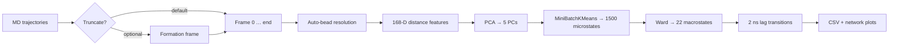
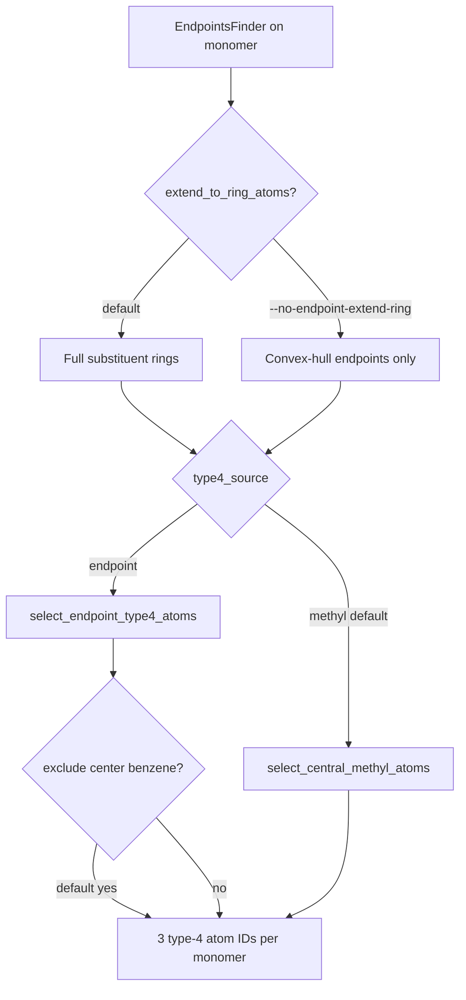

# Imamura Nanocube MSM Workflow

**MD_analysis implementation summary**  
*Based on Imamura, Yamamoto & Sato, Chem. Phys. Lett. **742**, 137135 (2020)*

---

## Motivation

Reproduce the Imamura group's Markov-state-style analysis of **GSA nanocube** trajectories inside this repository:

- Use existing **MDAnalysis**, **RDKit**, **GSA selections**, and **cluster inspection** utilities
- Provide a single CLI script for batch analysis
- Support **all-atom GSA** systems (e.g. BMMpM) via automatic bead picking

---

## Reference Pipeline (Imamura et al.)

| Step | Description | Default in this repo |
|------|-------------|----------------------|
| 1 | Truncate trajectories at nanocube formation | **Off** (opt-in via `--truncate-at-formation`) |
| 2 | Build **168-D** feature vector per frame | ✓ |
| 3 | **PCA** → 5 components | ✓ |
| 4 | **MiniBatchKMeans** (1500) → **Ward** merge (22 states) | ✓ |
| 5 | **2 ns** lagged transition network | ✓ |

---

## Feature Vector Construction (168 dimensions)

For each trajectory frame:

### Type-1 beads — central benzenes (6 beads → 15 distances)

- One bead per monomer = **geometric center** of the central benzene ring
- Ring identified with `RingCenterCalculator.find_center_benzene_ring()`
- All unique pairwise distances computed, **sorted descending** → **v₁** (15 values)

### Type-4 beads — substituent endpoints (18 beads → 153 distances)

- Three beads per monomer (18 total), selected from `EndpointAnalyzer` / `EndpointsFinder`
- **Default (`--type4-source methyl`):** methyl carbons only, via `select_central_methyl_atoms()` (bond-step distance from central benzene, intersected with endpoint hull)
- **Alternative (`--type4-source endpoint`):** raw endpoint atoms from `select_endpoint_type4_atoms()` — optionally excluding the central benzene ring already used for type-1
- Sorted descending pairwise distances → **v₄** (153 values)

**Endpoint discovery knobs** (apply when `--auto-beads` resolves type-4):

| Option | Default | Effect |
|--------|---------|--------|
| `--type4-source methyl` | ✓ | Bond-step methyl filter (Imamura paper–style) |
| `--type4-source endpoint` | | Use EndpointsFinder output directly |
| `--endpoint-extend-ring` | ✓ | Expand hull hits to full substituent rings |
| `--no-endpoint-extend-ring` | | Hull endpoints only (no ring expansion) |
| `--endpoint-exclude-center-benzene` | ✓ | Drop central benzene atoms from endpoint type-4 |
| `--no-endpoint-exclude-center-benzene` | | Allow central ring atoms as type-4 beads |

### Combined feature

```
v_f = [v₁ | v₄]   →   15 + 153 = 168 dimensions
```

---

## Pipeline Architecture



---

## New Repository Components

| File | Role |
|------|------|
| `src/utils/imamura_msm.py` | Core workflow: beads, features, PCA, clustering, transitions, plots; `ImamuraBeadResolutionOptions` |
| `scripts/run_imamura_msm.py` | CLI entry point |
| `src/utils/rdkit_utils.py` | `select_central_methyl_atoms`, `select_endpoint_type4_atoms`, endpoint methyl filters |

Reuses:

- `src/utils/gsa_selections.py` — monomer selections
- `src/utils/cluster_inspection.py` — transition heatmaps & network diagrams
- `src/TrajectoryIterator` — single-pass frame iteration

---

## Auto-Bead Selection (`--auto-beads`)

Per monomer (6 × MOL residues):

| Bead type | Method | Color in `auto_beads.png` |
|-----------|--------|---------------------------|
| **Type-1** | Central benzene ring → centroid each frame | Green |
| **Type-4** | Methyl filter **or** raw endpoints (see `--type4-source`) | Orange |

### Type-4 resolution modes



Artifacts written at bead resolution:

- `bead_spec.json` — ring groups, type-4 atom IDs, and resolution metadata (`type4_source`, `endpoint_extend_ring`, `endpoint_exclude_center_benzene`)
- `auto_beads.png` — 6-panel structure diagram; legend labels methyl vs endpoint mode

Alternative: `--bead-mode cg` for coarse-grained bead names (`B1`, `B4`).

---

## Formation Detection — Design Choice

### Imamura paper

Trajectories were truncated at the moment the nanocube **finished assembling**.

### Our trajectories (BMMpM)

**Already start as assembled nanocubes** → truncation is **disabled by default**.

### Bug found & fixed

Strict criterion `n_active_interfaces ≥ 15` failed at frame 0:

| Metric @ frame 0 (BMMpM) | Value |
|--------------------------|-------|
| Active interfaces (4.5 Å) | **12 / 15** |
| Largest connected component | **6 / 6** |
| Contact graph density | 0.80 |

The cage is connected and assembled, but not all 15 atom-pair interfaces exceed 4.5 Å.

### New logic (`is_nanocube_assembled`)

Assembly detected when **either**:

1. All monomers in one contact component (`LCC ≥ n_monomers`) → **returns frame 0** for pre-assembled trajectories  
2. `n_active_interfaces ≥ threshold` (strict 15/15 mode)

---

## Command-Line Usage

### Standard run (pre-assembled trajectories, default methyl type-4)

```bash
python scripts/run_imamura_msm.py \
  --topology traj/BMMpM_ca.prmtop \
  --trajectories traj/BMMpM_891249_mdcrd_v.trj \
  --format TRJ \
  --auto-beads --gsa-resname MOL \
  --output-dir output/imamura_msm
```

### Endpoint-based type-4 (no methyl filter)

```bash
python scripts/run_imamura_msm.py \
  --topology traj/BMMpM_ca.prmtop \
  --trajectories traj/BMMpM_891249_mdcrd_v.trj \
  --format TRJ \
  --auto-beads --gsa-resname MOL \
  --type4-source endpoint \
  --output-dir output/imamura_msm_endpoint
```

Hull endpoints only (disable benzene ring expansion):

```bash
python scripts/run_imamura_msm.py \
  ... --auto-beads --type4-source endpoint --no-endpoint-extend-ring
```

### Assembly trajectories (Imamura-style truncation)

```bash
python scripts/run_imamura_msm.py \
  ... \
  --truncate-at-formation
```

### Key flags

| Flag | Default | Purpose |
|------|---------|---------|
| `--auto-beads` | off | RDKit benzene + configurable type-4 bead resolution |
| `--type4-source` | `methyl` | `methyl` (bond-step filter) or `endpoint` (raw EndpointsFinder) |
| `--endpoint-extend-ring` | on | Expand endpoint hits to substituent rings |
| `--no-endpoint-extend-ring` | | Hull endpoints only |
| `--endpoint-exclude-center-benzene` | on | Drop central benzene from endpoint type-4 |
| `--no-endpoint-exclude-center-benzene` | | Keep central ring in endpoint type-4 |
| `--methyl-per-monomer` | 3 | Expected type-4 beads per monomer |
| `--truncate-at-formation` | off | Truncate at detected formation frame |
| `--dt-ps` | auto | Frame spacing in ps (needed for correct 2 ns lag on TRJ) |
| `--n-pca` | 5 | PCA components |
| `--n-micro` | 1500 | MiniBatchKMeans clusters |
| `--n-macro` | 22 | Ward macrostates |
| `--transition-lag-ns` | 2.0 | MSM lag time |
| `--stride` | 1 | Frame subsampling |

---

## Output Artifacts

```
output/imamura_msm/
├── bead_spec.json              # Resolved bead atom indices + type4 resolution metadata
├── auto_beads.png              # Visual validation of type-1 / type-4 beads
├── imamura_features.csv        # 168-D features per frame
├── frame_states.csv            # PC scores + micro/macro labels
├── pca_explained_variance.csv
├── micro_to_macro.csv
├── micro_pca_centroids.csv     # PC1/PC2 centroids per microcluster
├── pca_microstates.png         # PC1 vs PC2, colored by macrostate
├── microcluster_ward_dendrogram.png
├── state_transition_matrix.csv
├── state_transition_prob.csv
├── state_transitions.csv
├── transition_matrix.png
├── transition_network.png
└── pipeline_summary.txt
```

---

## Example Run Summary (BMMpM)

From `output/imamura_msm/pipeline_summary.txt`:

- **Frames analyzed:** 5,000 (full trajectory, stride 1)
- **Feature dimension:** 168
- **PCA variance explained (PC1–PC5):** ~0.80
- **Microclusters:** 1,500 → **Macrostates:** 22
- **Transition lag:** 2 ns (frame offset from trajectory `dt`)

Quick test with `--stride 100` (50 frames) also completed successfully end-to-end.

---

## Takeaways

1. **Imamura MSM pipeline is integrated** into MD_analysis with utils + CLI.
2. **Auto-beads** map paper definitions onto all-atom GSA via RDKit + endpoints—not only CG bead names.
3. **Type-4 beads are configurable:** default methyl filter matches the paper; `--type4-source endpoint` plus ring-expansion flags support alternative chemistries or QC comparisons.
4. **Visual QC** via `auto_beads.png` before running expensive clustering.
5. **Formation detection** is opt-in; pre-assembled cubes use frame 0 without spurious failures.
6. **Contact-graph LCC** is a more robust assembly criterion than 15/15 interfaces for this chemistry.
7. Set **`--dt-ps`** when trajectory metadata lacks a timestep (e.g. Amber TRJ) so the 2 ns transition lag is frame-accurate.

---

## Suggested Next Steps

- Compare **methyl vs endpoint** type-4 bead definitions on the same trajectory (`auto_beads.png` side-by-side)
- Run across all 52 Imamura-style trajectories with a shared `--stride`
- Compare macrostate populations / transition networks between cube chemistries
- Overlay macrostate labels on existing changepoint / GSA feature analyses
- Tune `--n-macro` or lag time if transition matrix is too sparse or dense

---

*Generated from MD_analysis development session — Imamura MSM workflow implementation.*
