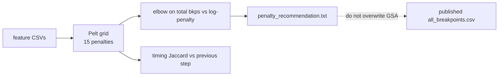

# Penalty sweep across B\* cubes (endpoint + GSA)

**MD_analysis — notes for talks / writeups**  
Code: `src/ChangepointAnalysis/penalty_sweep.py`, `scripts/sweep_changepoint_penalty.py`, `scripts/sweep_gsa_changepoint_penalty.py`, `scripts/plot_penalty_sweep_cohorts.py`  
Pipeline context: [changepoint_pipeline.md](changepoint_pipeline.md) (penalty-sweep stage)

These notes record *what* the Pelt penalty grids showed on the six B\* cubes, *why* relative elbows agree while absolute penalties do not, and *which* operating penalty each family should use. Figures are written by `scripts/plot_penalty_sweep_cohorts.py` from existing `penalty_sweep/` CSVs (no re-detect).

---

## 1. What was swept

There is no `gsa_endpoints_B*` tree. The two families are:

| Family | Directories | Signal length | Groups swept | Relative grid |
|--------|-------------|---------------|--------------|---------------|
| Endpoint | `output/endpoint_changepoints_{CUBE}/penalty_sweep/` | 1000 frames (stride-5 of 5000-frame GSA) | `endpoint` | 0.2–5 × log(n), 15 steps |
| GSA | `output/gsa_changepoints_{CUBE}/penalty_sweep/` | 5000 frames | `gsa` + `iodine` only | 0.2–2.5 × log(5000), 15 steps (1.70–21.29) |

Cubes: **BHHpH, BHHpM, BMHpH, BMHpM, BMMpH, BMMpM**.

Published GSA `all_breakpoints.csv` tables were **not** overwritten — they remain at BIC-style log(n) ≈ 8.52. `na_water` and `combined` were omitted: rbf Pelt on 5000 frames is too slow at the high-penalty end (`na_water` ~7× slower than `gsa`).



Regenerate the comparison figures (this document’s images):

```powershell
python scripts/plot_penalty_sweep_cohorts.py --out-dir output/penalty_sweep_cohort_comparison
```

---

## 2. Relative elbows agree; absolute penalties do not

Every cube uses the same *relative* grid (penalty / log(n)). Endpoint elbows cluster at **0.63 × log(n)** (BMHpM one step earlier at 0.50×). GSA elbows cluster at **0.59 × log(n)** (BHHpM one step earlier at 0.49×). Absolute numbers differ because *n* and the feature groups differ.

| | Typical elbow vs log(n) | Shared absolute elbow | n used for log(n) |
|--|-------------------------|------------------------|-------------------|
| Endpoint | 0.63× | **4.36** (n = 1000 cubes) | 1000 for four cubes; first-CSV length for BMHpH / BMMpM |
| GSA | 0.59× | **5.03** (five of six cubes) | median n = 5000 |

Do **not** copy 4.36 onto GSA or 5.03 onto endpoint. Compare families on the relative axis, then convert with that family’s log(n).

---

## 3. Endpoint: cube chemistry sets the rate, the knee is shared


Mean endpoint breakpoints per trajectory vs penalty / log(n). Open circles mark the elbow; the dashed line is log(n). Vertical position of the knee is cube chemistry (BHH more events than BMM); the knee location on the x-axis is shared.

| Cube | log(n) | Elbow | × log(n) | Elbow bkps / traj | log(n) bkps / traj | Published detection |
|------|--------|-------|----------|-------------------|--------------------|---------------------|
| BHHpH | 6.91 | 4.36 | 0.63 | 10.7 | 7.3 | Matches elbow (535) |
| BHHpM | 6.91 | 4.36 | 0.63 | 10.3 | 6.8 | **Not elbow** (315 vs 515; nearer log(n) = 341) |
| BMHpH | 5.58\* | 3.53 | 0.63 | 6.0 | 3.6 | Elbow (305) |
| BMHpM | 6.91 | 3.47 | 0.50 | 6.4 | 3.8 | Elbow (319) |
| BMMpH | 6.91 | 4.36 | 0.63 | 2.7 | 1.6 | Elbow (137) |
| BMMpM | 6.61\* | 4.18 | 0.63 | 2.5 | 1.5 | **Not elbow** (83 vs 128) |

\*Grid reference taken from the first feature CSV, not the cohort median n = 1000. BHHpM published count (315) is closer to log(n) = 341 than to the elbow. BMMpM published 83 breakpoints on 30 trajectories; the elbow had 128 on 51.

A shared endpoint penalty of **4.36** is defensible for the n = 1000 cubes. Event rate ranks **BHH > BMH > BMM** at every matched relative penalty.

---

## 4. GSA: same relative story on 5000 frames


Cohort mean breakpoints per trajectory for **gsa + iodine** combined. Absolute elbow **5.028** is shared for five cubes; BHHpM is one step earlier (4.198).


At the knee, cage geometry (`gsa`) still ranks BHH > BMH > BMM. Iodine does not (~47–59 bkps/traj on every cube at the elbow).

| Cube | Elbow | × log(n) | gsa at elbow | iodine at elbow | gsa at log(n) grid | Published gsa (still log(n)?) |
|------|-------|----------|--------------|-----------------|--------------------|-------------------------------|
| BHHpH | 5.03 | 0.59 | 2451 | 2358 | 1527 | Yes (1551) |
| BHHpM | 4.20 | 0.49 | 3040 | 2936 | 1666 | Yes (1692) |
| BMHpH | 5.03 | 0.59 | 2282 | 2302 | 1426 | Yes (1443) |
| BMHpM | 5.03 | 0.59 | 2155 | 2438 | 1372 | Yes (1390) |
| BMMpH | 5.03 | 0.59 | 1699 | 2477 | 1074 | Yes (1090) |
| BMMpM | 5.03 | 0.59 | 1487 | 2487 | 919 | Yes (928) |

Counts are cohort totals. Sweep `gsa` at the log(n) grid step matches published `all_breakpoints.csv` to within ~2%. The elbow has ~**60% more `gsa` breakpoints** than published log(n).

A shared GSA penalty of **5.03** is defensible for five of six cubes (BHHpM 4.20). Re-detecting GSA at 5.03 would add that extra ~60% of cage events; this document does not do that.

---

## 5. Event density on a shared per-1000-frame scale

Endpoint signals are 1000 frames; GSA signals are 5000. Raw breakpoints per trajectory are not comparable. The bar chart rescales both to **breakpoints per 1000 frames**.


| Cube | Endpoint at elbow | GSA geometry at elbow | GSA geometry at log(n) | GSA iodine at log(n) |
|------|-------------------|-----------------------|------------------------|----------------------|
| BHHpH | 10.7 | 9.80 | 6.20 | 5.36 |
| BHHpM | 10.3 | 12.16 | 6.77 | 5.76 |
| BMHpH | 5.98 | 8.95 | 5.66 | 5.25 |
| BMHpM | 6.38 | 8.62 | 5.56 | 5.61 |
| BMMpH | 2.74 | 6.80 | 4.36 | 5.56 |
| BMMpM | 2.51 | 5.83 | 3.64 | 5.55 |

At the GSA elbow, cage geometry is ~1.6× denser than the published log(n) tables and closer to endpoint BHH rates. Iodine at log(n) stays cube-flat (~5.3–5.8 / 1000 frames). Endpoint still ranks BHH ≫ BMM (~4×).


Same density, now as curves vs penalty / log(n). Timing comparisons between the two pipelines should use **matched relative penalties**, not log(n) GSA vs elbow endpoint.

---

## 6. Timing is only moderately stable at the elbow

Timing Jaccard is the mean breakpoint-set overlap vs the previous grid step (tolerance = 50 frames). The plateau finder uses 0.75 as a “counts barely move” threshold. Current code uses 1-to-1 matching in `compare_breakpoints` ([changepoint_jaccard_metric.md](changepoint_jaccard_metric.md)); the CSVs behind these figures were written with the older formula. Elbows use counts, not this Jaccard, so operating penalties are unaffected. Consecutive Pelt steps keep many exact indices, which is the case where the old formula was already valid.


Elbow steps sit around 0.64–0.77 — near or below 0.75 — so the knee is still on the **sloping** part of the curve. Jaccard rises in the high-penalty tail because almost nothing moves, not because that tail is a good operating point.

### Do not use the “robust band” as the operating penalty

`find_stable_plateaus` ranks long stretches of slow count drift. For most **endpoint** cubes that band is the high-penalty tail (few events, Jaccard high). Using the band midpoint would under-segment BHH (~2–4 bkps/traj) and nearly silence BMM. The elbow is the intended operating point; the band is a diagnostic that the over-penalized end is locally stable.

| Cube | Best endpoint band | Steps | Bkps in band | Elbow inside band? | Passes regime ≥ 0.85? |
|------|--------------------|-------|--------------|--------------------|------------------------|
| BHHpH | 3.47–8.69 | 5 | 309–653 | Yes | No (0.67) |
| BHHpM | 10.94–34.54 | 6 | 66–216 | No | Yes |
| BMHpH | 5.58–27.92 | 8 | 44–184 | No | Yes |
| BMHpM | 13.77–34.54 | 5 | 37–90 | No | No (0.00) |
| BMMpH | 2.19–4.36 | 4 | 137–301 | Yes (at max) | No (0.67) |
| BMMpM | 8.32–33.07 | 7 | 23–64 | No | No |

GSA “best bands” span almost the whole 0.2–2.5 × log(n) grid (11–14 of 15 steps). That is the same diagnostic failure: the plateau scorer prefers a long, slowly decaying count curve over a tight knee. Do not take the GSA band midpoint as the penalty.

---

## 7. What this means for the two pipelines

1. **Shared endpoint penalty 4.36** for n = 1000 cubes. BMHpM’s elbow is 3.47 (0.50×); BHHpM / BMMpM published tables are **not** at their elbows.
2. **Shared GSA penalty 5.03** for five of six cubes (BHHpM 4.20). Published GSA tables stay at log(n). Re-detect at 5.03 only if you want ~60% more `gsa` breakpoints.
3. Relative elbows agree (≈0.5–0.63 × log(n)). Absolute penalties are not interchangeable.
4. Cube chemistry, not penalty, sets event rate: **BHH > BMH > BMM** for endpoint and for GSA geometry. Iodine is cube-flat.
5. Endpoint BMHpH / BMMpM grids used the first CSV length instead of median n = 1000. The sweep now uses **median n** for the default grid; those two endpoint sweeps were not re-run.

`na_water` / `combined` were not swept. Re-run `python scripts/sweep_gsa_changepoint_penalty.py --groups na_water` if those elbows are needed.

---

## 8. Per-cube sweep files

| Cube | Endpoint trajectories | Endpoint grid | Endpoint sweep dir |
|------|----------------------|---------------|--------------------|
| BHHpH | 50 × 1000 fr | 1.38–34.54 | `output/endpoint_changepoints_BHHpH/penalty_sweep` |
| BHHpM | 50 × 1000 fr | 1.38–34.54 | `output/endpoint_changepoints_BHHpM/penalty_sweep` |
| BMHpH | 50 × 1000 + 1 × 266 | 1.12–27.92 | `output/endpoint_changepoints_BMHpH/penalty_sweep` |
| BMHpM | 50 × 1000 fr | 1.38–34.54 | `output/endpoint_changepoints_BMHpM/penalty_sweep` |
| BMMpH | 50 × 1000 fr | 1.38–34.54 | `output/endpoint_changepoints_BMMpH/penalty_sweep` |
| BMMpM | 48 × 1000 + 3 short | 1.32–33.07 | `output/endpoint_changepoints_BMMpM/penalty_sweep` |

GSA for every cube: 50 or 51 trajectories × 5000 frames, grid 1.70–21.29, directory `output/gsa_changepoints_{CUBE}/penalty_sweep`.

Comparison artifacts: `output/penalty_sweep_cohort_comparison/` (`cohort_sweep_summary.csv`, `density_per_1000_frames.csv`, `plots/*.png`).

---

## 9. Related code

| File | Role |
|------|------|
| `src/ChangepointAnalysis/penalty_sweep.py` | Elbow, plateaus, median-n grid, trajectory process pool |
| `scripts/sweep_changepoint_penalty.py` | Generic sweep CLI (`--groups`, `--n-jobs`, optional `--run-final`) |
| `scripts/sweep_gsa_changepoint_penalty.py` | Per-cube GSA launcher so pools do not nest; defaults `gsa`/`iodine`, no `--run-final` |
| `scripts/plot_penalty_sweep_cohorts.py` | This document’s figures |
| `tests/test_changepoint_pipeline.py` | `test_resolve_sweep_workers` |
