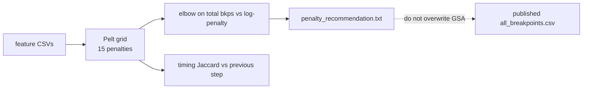

# Penalty sweep across B\* cubes (endpoint + GSA)

**MD_analysis — notes for talks / writeups**  
Code: `src/ChangepointAnalysis/penalty_sweep.py`, `scripts/sweep_changepoint_penalty.py`, `scripts/sweep_gsa_changepoint_penalty.py`, `scripts/plot_penalty_sweep_cohorts.py`  
Pipeline context: [changepoint_pipeline.md](changepoint_pipeline.md) (penalty-sweep stage)

These notes record *what* the Pelt penalty grids showed on the six B\* cubes, *why* relative elbows agree while absolute penalties do not, and *which* operating penalty each family should use. Figures are written by `scripts/plot_penalty_sweep_cohorts.py` from existing `penalty_sweep/` CSVs (no re-detect).

**Updated:** BMHpH and BMMpM were originally swept on a grid built from the first feature CSV's length rather than the cohort median (both n=1000 cohorts, off by a short outlier file). Both were re-swept on the correct median-n=1000 grid and re-detected as full 51-trajectory runs. BMHpH's corrected elbow (4.361, 0.631×log n) lands on the same relative step as BHHpH/BHHpM — a coincidence of the data, not a forced match. **BMMpM's corrected elbow does not**: it is 5.489, 0.795×log(n), genuinely higher than every other cube, confirmed by a from-scratch full-cohort detection, not just the sweep search. All six cubes now use each cube's own elbow with no cross-cohort alignment — see `plan.md` §3.1/§5 (G1a/G1b) for the decision record and full provenance.

---

## 1. What was swept

There is no `gsa_endpoints_B*` tree. The two families are:

| Family | Directories | Signal length | Groups swept | Relative grid |
|--------|-------------|---------------|--------------|---------------|
| Endpoint | `output/endpoint_changepoints_{CUBE}/penalty_sweep/` | 1000 frames (stride-5 of 5000-frame GSA) | `endpoint` | 0.2–5 × log(n), 15 steps |
| GSA | `output/gsa_changepoints_{CUBE}/penalty_sweep/` | 5000 frames | `gsa` + `iodine` only | 0.2–2.5 × log(5000), 15 steps (1.70–21.29) |

Cubes: **BHHpH, BHHpM, BMHpH, BMHpM, BMMpH, BMMpM**.

Published GSA `all_breakpoints.csv` tables were **not** overwritten — they remain at BIC-style log(n) ≈ 8.52. `na_water` and `combined` were omitted: rbf Pelt on 5000 frames is too slow at the high-penalty end (`na_water` ~7× slower than `gsa`).



Regenerate the comparison figures (this document’s images):

```powershell
python scripts/plot_penalty_sweep_cohorts.py --out-dir output/penalty_sweep_cohort_comparison
```

---

## 2. Relative elbows cluster in three groups; absolute penalties do not transfer

Every cube uses the same *relative* grid (penalty / log(n)), now correctly built from the median n=1000 for every endpoint cube. Endpoint elbows split into **three** relative groups, not one shared value: **0.631×** (BHHpH, BHHpM, BMHpH), **0.502×** (BMHpM, BMMpH), and **0.795×** (BMMpM, alone). GSA elbows cluster at **0.59 × log(n)** (BHHpM one step earlier at 0.49×). Absolute numbers differ because *n* and the feature groups differ.

| | Elbow vs log(n) | Absolute elbow | Cubes | n used for log(n) |
|--|-------------------------|------------------------|-------|-------------------|
| Endpoint | 0.631× | **4.361** | BHHpH, BHHpM, BMHpH | median n = 1000, all six cubes |
| Endpoint | 0.502× | **3.466** | BMHpM, BMMpH | median n = 1000 |
| Endpoint | **0.795×** | **5.489** | **BMMpM only** | median n = 1000 |
| GSA | 0.59× | **5.03** (five of six cubes) | all but BHHpM | median n = 5000 |

Do **not** copy 4.36 onto GSA or 5.03 onto endpoint, and do **not** copy 4.361 onto BMMpM — its own elbow is 5.489, and forcing it onto the other cubes' step was tried and rejected (see the sensitivity run at `output/endpoint_changepoints_g1a_BMMpM`, kept on disk but not the reported result). Compare families on the relative axis, then convert with that family's own log(n) *and* that cube's own elbow.

---

## 3. Endpoint: cube chemistry sets the rate, the knee is shared


Mean endpoint breakpoints per trajectory vs penalty / log(n). Open circles mark the elbow; the dashed line is log(n). Vertical position of the knee is cube chemistry (BHH more events than BMM); the knee location on the x-axis is shared.

| Cube | log(n) | Elbow | × log(n) | Elbow bkps / traj | log(n) bkps / traj | Published detection |
|------|--------|-------|----------|-------------------|--------------------|---------------------|
| BHHpH | 6.91 | 4.361 | 0.631 | 10.06 | 7.3 | Matches elbow (503/50) |
| BHHpM | 6.91 | 4.361 | 0.631 | 9.76 | 6.8 | **Not elbow** (315 vs 488; nearer log(n) = 341) |
| BMHpH | 6.91 | 4.361 | 0.631 | 4.57 | 3.6 | **Not elbow** (305 on the old wrong grid, since corrected; 233 at the true elbow) |
| BMHpM | 6.91 | 3.466 | 0.502 | 6.60 | 3.8 | Elbow (330) |
| BMMpH | 6.91 | 3.466 | 0.502 | 3.12 | 1.6 | Elbow (156) |
| BMMpM | 6.91 | **5.489** | **0.795** | **2.078** | 1.5 | **Not elbow**, and its own elbow is not the 4.361 the other three cubes share (106 at true elbow, on 51 trajectories) |

All six cubes now use the correct median n = 1000 grid — the earlier first-CSV-length grid bug for BMHpH and BMMpM is fixed (`plan.md` §3.1, G1a). BMHpH's corrected elbow happens to land on the same relative step as BHHpH/BHHpM (0.631×); that is a property of the data, not a forced match. **BMMpM's corrected elbow does not converge toward the others** — re-sweeping on the right grid moved it *further* from 0.631× (from a wrong-grid 0.761× to a corrected 0.795×), confirmed by a full 51-trajectory re-detection, not just the sweep search.

Event rate ranks **BHH > BMH > BMM** at every cube's own elbow. Do not apply a single shared endpoint penalty across all six cubes — three genuinely different relative elbows exist (§2), and BMMpM is the one cube where using another cohort's penalty materially changes the reported event rate.

---

## 4. GSA: same relative story on 5000 frames


Cohort mean breakpoints per trajectory for **gsa + iodine** combined. Absolute elbow **5.028** is shared for five cubes; BHHpM is one step earlier (4.198).


At the knee, cage geometry (`gsa`) still ranks BHH > BMH > BMM. Iodine does not (~47–59 bkps/traj on every cube at the elbow).

| Cube | Elbow | × log(n) | gsa at elbow | iodine at elbow | gsa at log(n) grid | Published gsa (still log(n)?) |
|------|-------|----------|--------------|-----------------|--------------------|-------------------------------|
| BHHpH | 5.03 | 0.59 | 2451 | 2358 | 1527 | Yes (1551) |
| BHHpM | 4.20 | 0.49 | 3040 | 2936 | 1666 | Yes (1692) |
| BMHpH | 5.03 | 0.59 | 2282 | 2302 | 1426 | Yes (1443) |
| BMHpM | 5.03 | 0.59 | 2155 | 2438 | 1372 | Yes (1390) |
| BMMpH | 5.03 | 0.59 | 1699 | 2477 | 1074 | Yes (1090) |
| BMMpM | 5.03 | 0.59 | 1487 | 2487 | 919 | Yes (928) |

Counts are cohort totals. Sweep `gsa` at the log(n) grid step matches published `all_breakpoints.csv` to within ~2%. The elbow has ~**60% more `gsa` breakpoints** than published log(n).

A shared GSA penalty of **5.03** is defensible for five of six cubes (BHHpM 4.20). Re-detecting GSA at 5.03 would add that extra ~60% of cage events; this document does not do that.

---

## 5. Event density on a shared per-1000-frame scale

Endpoint signals are 1000 frames; GSA signals are 5000. Raw breakpoints per trajectory are not comparable. The bar chart rescales both to **breakpoints per 1000 frames**.


| Cube | Endpoint at elbow | GSA geometry at elbow | GSA geometry at log(n) | GSA iodine at log(n) |
|------|-------------------|-----------------------|------------------------|----------------------|
| BHHpH | 10.06 | 9.80 | 6.20 | 5.36 |
| BHHpM | 9.76 | 12.16 | 6.77 | 5.76 |
| BMHpH | 4.57 | 8.95 | 5.66 | 5.25 |
| BMHpM | 6.60 | 8.62 | 5.56 | 5.61 |
| BMMpH | 3.12 | 6.80 | 4.36 | 5.56 |
| BMMpM | 2.08 | 5.83 | 3.64 | 5.55 |

Endpoint column is each cube's own elbow, final (`plan.md` §3, G1b). At the GSA elbow, cage geometry is ~1.6× denser than the published log(n) tables and closer to endpoint BHH rates. Iodine at log(n) stays cube-flat (~5.3–5.8 / 1000 frames). Endpoint still ranks BHH ≫ BMM (~4.7×, own-elbow throughout — see §3 and `plan.md` §3.3 for the exact ratio against Murata's reported values).


Same density, now as curves vs penalty / log(n). Timing comparisons between the two pipelines should use **matched relative penalties**, not log(n) GSA vs elbow endpoint.

---

## 6. Timing is only moderately stable at the elbow

Timing Jaccard is the mean breakpoint-set overlap vs the previous grid step (tolerance = 50 frames). The plateau finder uses 0.75 as a “counts barely move” threshold. Current code uses 1-to-1 matching in `compare_breakpoints` ([changepoint_jaccard_metric.md](changepoint_jaccard_metric.md)); the CSVs behind these figures were written with the older formula. Elbows use counts, not this Jaccard, so operating penalties are unaffected. Consecutive Pelt steps keep many exact indices, which is the case where the old formula was already valid.


Elbow steps sit around 0.64–0.77 — near or below 0.75 — so the knee is still on the **sloping** part of the curve. Jaccard rises in the high-penalty tail because almost nothing moves, not because that tail is a good operating point.

### Do not use the “robust band” as the operating penalty

`find_stable_plateaus` ranks long stretches of slow count drift. For most **endpoint** cubes that band is the high-penalty tail (few events, Jaccard high). Using the band midpoint would under-segment BHH (~2–4 bkps/traj) and nearly silence BMM. The elbow is the intended operating point; the band is a diagnostic that the over-penalized end is locally stable.

| Cube | Best endpoint band | Steps | Bkps in band | Elbow inside band? | Passes regime ≥ 0.85? |
|------|--------------------|-------|--------------|--------------------|------------------------|
| BHHpH | 3.47–8.69 | 5 | 309–653 | Yes | No (0.67) |
| BHHpM | 10.94–34.54 | 6 | 66–216 | No | Yes |
| BMHpH | 5.58–27.92\* | 8 | 44–184 | No | Yes |
| BMHpM | 13.77–34.54 | 5 | 37–90 | No | No (0.00) |
| BMMpH | 2.19–4.36 | 4 | 137–301 | Yes (at max) | No (0.67) |
| BMMpM | 8.32–33.07\* | 7 | 23–64 | No | No |

\*BMHpH and BMMpM rows are from the plateau finder on the **old, wrong grid** and have not been re-run on the corrected median-n grid — only the elbow and a full detection were redone for those two cubes (§1, §3). Treat these two rows as stale until `find_stable_plateaus` is re-run on `penalty_sweep_median_n/`; the conclusion in the paragraph below (do not use the band) is unaffected either way.

GSA “best bands” span almost the whole 0.2–2.5 × log(n) grid (11–14 of 15 steps). That is the same diagnostic failure: the plateau scorer prefers a long, slowly decaying count curve over a tight knee. Do not take the GSA band midpoint as the penalty.

---

## 7. What this means for the two pipelines

1. **Three endpoint elbows, not one shared value.** 4.361 (0.631×) for BHHpH/BHHpM/BMHpH; 3.466 (0.502×) for BMHpM/BMMpH; **5.489 (0.795×) for BMMpM alone.** BHHpM's published table is **not** at its elbow. Each cube now uses its own elbow (`plan.md` §5, G1b) — no cross-cohort alignment.
2. **Shared GSA penalty 5.03** for five of six cubes (BHHpM 4.20). Published GSA tables stay at log(n). Re-detect at 5.03 only if you want ~60% more `gsa` breakpoints.
3. Relative elbows mostly agree (0.50–0.63 × log(n)), except BMMpM at 0.795× — a genuine cohort difference, not a grid artifact. Absolute penalties are not interchangeable.
4. Cube chemistry, not penalty, sets event rate: **BHH > BMH > BMM** for endpoint and for GSA geometry. Iodine is cube-flat.
5. Endpoint BMHpH / BMMpM grids originally used the first CSV length instead of median n = 1000. **Fixed and re-run**: both were re-swept on the correct median-n grid and re-detected as full 51-trajectory runs (`output/endpoint_changepoints_g1a_BMHpH`, `output/endpoint_changepoints_g1b_BMMpM`). BMHpH's corrected elbow coincides with the 0.631× group; BMMpM's does not.

`na_water` / `combined` were not swept. Re-run `python scripts/sweep_gsa_changepoint_penalty.py --groups na_water` if those elbows are needed.

---

## 8. Per-cube sweep files

| Cube | Endpoint trajectories | Endpoint grid | Endpoint sweep dir |
|------|----------------------|---------------|--------------------|
| BHHpH | 50 × 1000 fr | 1.38–34.54 | `output/endpoint_changepoints_BHHpH/penalty_sweep` |
| BHHpM | 50 × 1000 fr | 1.38–34.54 | `output/endpoint_changepoints_BHHpM/penalty_sweep` |
| BMHpH | 51 × 1000 fr | 1.38–34.54 (corrected; was 1.12–27.92 on the wrong grid) | `output/endpoint_changepoints_BMHpH/penalty_sweep_median_n`, full re-detection at `output/endpoint_changepoints_g1a_BMHpH` |
| BMHpM | 50 × 1000 fr | 1.38–34.54 | `output/endpoint_changepoints_BMHpM/penalty_sweep` |
| BMMpH | 50 × 1000 fr | 1.38–34.54 | `output/endpoint_changepoints_BMMpH/penalty_sweep` |
| BMMpM | 51 × 1000 fr | 1.38–34.54 (corrected; was 1.32–33.07 on the wrong grid) | `output/endpoint_changepoints_BMMpM/penalty_sweep_median_n`, full re-detection at `output/endpoint_changepoints_g1b_BMMpM` |

GSA for every cube: 50 or 51 trajectories × 5000 frames, grid 1.70–21.29, directory `output/gsa_changepoints_{CUBE}/penalty_sweep`.

Comparison artifacts: `output/penalty_sweep_cohort_comparison/` (`cohort_sweep_summary.csv`, `density_per_1000_frames.csv`, `plots/*.png`) — these figures were **not** regenerated after the BMHpH/BMMpM grid fix; the numeric tables in this document are, but the PNGs under that directory may still show the old wrong-grid sweep curves for those two cubes. Re-run `scripts/plot_penalty_sweep_cohorts.py` to refresh them.

---

## 9. Related code

| File | Role |
|------|------|
| `src/ChangepointAnalysis/penalty_sweep.py` | Elbow, plateaus, median-n grid, trajectory process pool |
| `scripts/sweep_changepoint_penalty.py` | Generic sweep CLI (`--groups`, `--n-jobs`, optional `--run-final`) |
| `scripts/sweep_gsa_changepoint_penalty.py` | Per-cube GSA launcher so pools do not nest; defaults `gsa`/`iodine`, no `--run-final` |
| `scripts/plot_penalty_sweep_cohorts.py` | This document’s figures |
| `tests/test_changepoint_pipeline.py` | `test_resolve_sweep_workers` |
